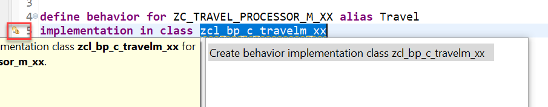
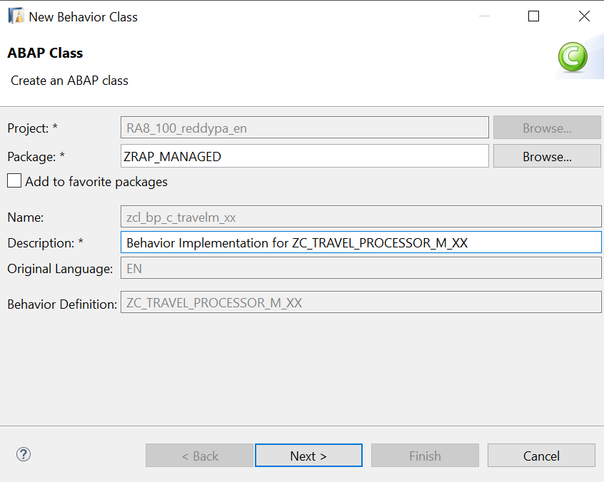
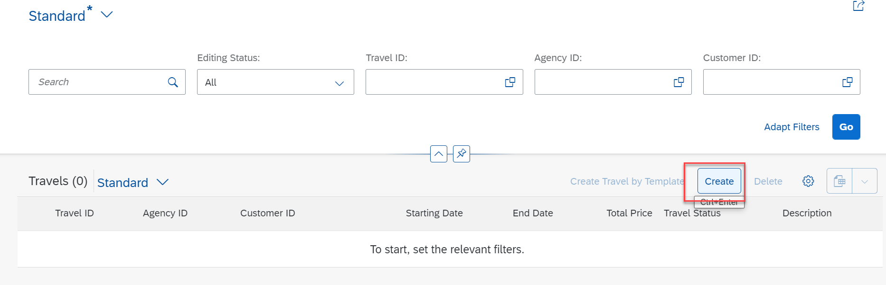
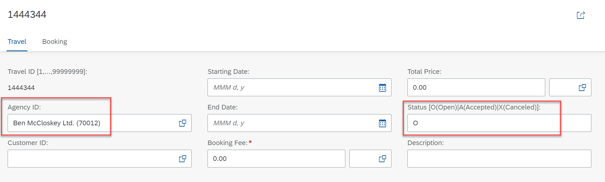
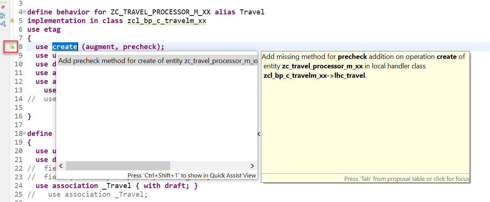
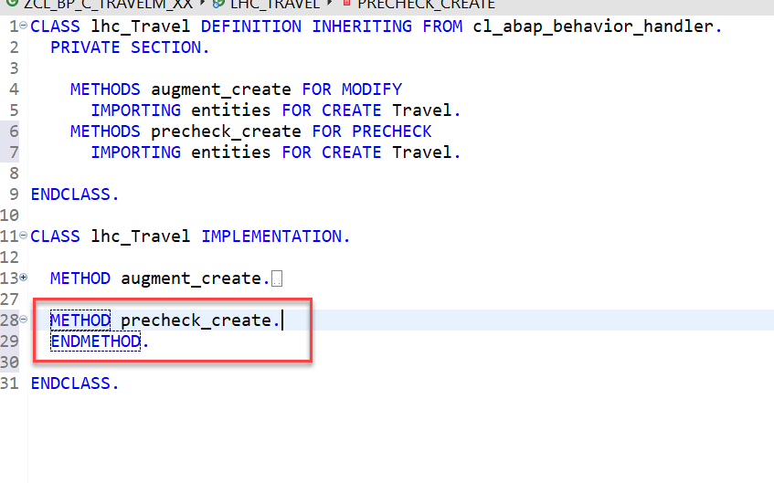
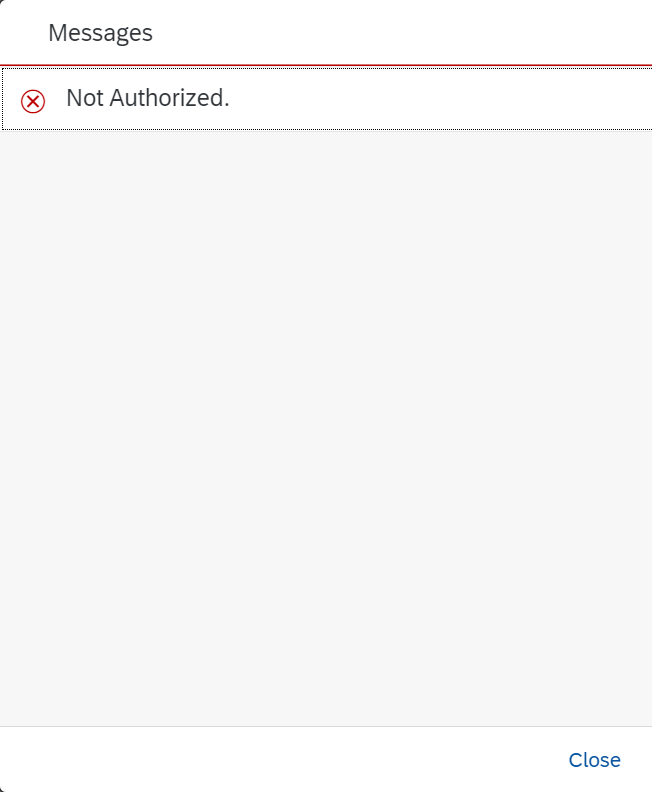

**Previous Step**


[Draft Handling for semantic key based scenario](/docs/Managed%20Implementation/DraftSemanticKey/README.md)

# Integrating Augment and Precheck in managed Business Objects
* [Exercise 1 - Integrating Augment in Managed Business Objects](#exercise-1)
* [Exercise 2 - Integrating Pre check in Managed Business Objects](#exercise-2)

<a id="exercise-1"></a>
# Exercise 1 - Integrating Augment in Managed Business Objects
With an augmentation implementation you can add data or modify incoming requests on the projection layer before data reaches the transactional buffer.
You can add data to a modify request or issue additional requests by augmenting the operation before the request is passed to the base business object.

### Use case
•	Defaulting for incoming requests.

•	Behavior-enabling denormalized fields, for example enabling editing of language dependent fields.

#### Definition
Augmentation is defined in the projection behavior definition on the relevant operation with the following syntax:

```
define behavior for Entity [alias AliasedName]
  ..
{
  use create (augment);
  use update (augment); 

  use association AssocName { create (augment); }
  ...
}
```

1.	In your projection behavior **ZC_TRAVEL_PROCESSOR_M_XX** definition, define augmentation for the create  operation.

```
use create (augment);

```

2.	Add behavior implementation class to the Travel behavior.

```
…
define behavior for ZC_TRAVEL_PROCESSOR_M_XX alias Travel
implementation in class zcl_bp_c_travelm_xx
….
```

3.	Click the activation button or use the shortcut `Ctrl + F3` to activate the behavior definition.

4.	The ADT Quick Fix feature can be used to create implementation class for travel entity.

For this, set the cursor on the class name, and press `Ctrl+1` to star the Quick Fix dialog.




Click on create behavior implementation to create the class.



5.	In the method implementation paste the below code. where XX is your chosen suffix – of your business object.

```
  METHOD augment_create.
  
   DATA: travel_create TYPE TABLE FOR CREATE zi_travel_m_xx.

    travel_create = CORRESPONDING #( entities ).
    LOOP AT travel_create ASSIGNING FIELD-SYMBOL(<travel>).
      <travel>-agency_id = '070012'.
      <travel>-status  = 'O'.
      <travel>-%control-agency_id = if_abap_behv=>mk-on.
      <travel>-%control-status = if_abap_behv=>mk-on.
    ENDLOOP.

    MODIFY AUGMENTING ENTITIES OF zi_travel_m_xx ENTITY Travel CREATE FROM travel_create.
  ENDMETHOD.
  
  ```
  
6.	Save and Activate the Class.

7.	Test the app now using preview tool. On Click of `Create` AgencyID and Status are defaulted.





#### Solution 
Solution for this exercise can be found [here](/docs/Managed%20Implementation/Augment%20and%20Precheck/Solutions/Augment)

<a id="exercise-2"></a>
# Exercise 2 - Integrating Pre Check in Managed Business Objects

With a precheck implementation you can deny incoming requests before data reaches the transactional buffer.
You can prevent illegal changes from reaching the transactional buffer by prechecking modify operations.

### Use case

•	Authorization checks against incoming values.

•	Uniqueness checks in managed BO scenarios with an unmanaged lock implementation, or unmanaged BO scenarios.

The precheck can be defined for every modify operation in the behavior definition or in the projection behavior definition with the following syntax:

```
define behavior for Entity [alias AliasedName]
  ..
{
  [use] create (precheck);
  [use] update (precheck); 
  [use] delete (precheck);

  [use] action (precheck) ActionName … ; 

  [use] association AssocName { create (precheck); }
  ...
}

```

If the precheck is used for an operation in the projection behavior definition, the method must be implemented in the behavior pool for the projection.
The precheck method is called during runtime before the assigned modify operation and removes all input from the modifying request for which the condition in the precheck is not fulfilled.
Depending on the use case, you can define a precheck for the operation in the BO-layer or in the projection layer. Also, it is possible to define for both layers.
1.	In your projection behavior **ZC_TRAVEL_PROCESSOR_M_XX** definition, define precheck for the create  operation.

```
use create (augment, precheck);
```


2.	Click the activation button or use the shortcut `Ctrl + F3` to activate the behavior definition.
3.	The ADT Quick Fix feature can be used to create precheck method for travel create entity.

For this, set the cursor on the class name, and press `Ctrl+1` to star the Quick Fix dialog.



Click on add precheck method to create method definition



4.	In the method implementation paste the below code. where XX is your chosen suffix – of your business object.

```
  METHOD precheck_create.

    LOOP AT entities INTO DATA(entity) WHERE TravelID IS NOT INITIAL.
      APPEND VALUE #( %cid        = entity-%cid
                      %is_draft   = entity-%is_draft
                      %key        = entity-%key
                      %create     = if_abap_behv=>mk-on ) TO failed-travel.
      APPEND VALUE #( %cid        = entity-%cid
                      %is_draft   = entity-%is_draft
                      %key        = entity-%key
                      %msg        = new_message_with_text(
                                      severity = if_abap_behv_message=>severity-error
                                      text     = 'The service does not support external numbering'
                                    ) ) TO reported-travel.


    ENDLOOP.


IF sy-uname = 'RAP-XX'. "Replace XX with your user
      LOOP AT entities INTO DATA(entity1).
      APPEND VALUE #( %cid        = entity1-%cid
                      %is_draft   = entity1-%is_draft
                      %key        = entity1-%key
                      %create     = if_abap_behv=>mk-on ) TO failed-travel.

        APPEND VALUE #( %cid        = entity1-%cid
                          %is_draft   = entity1-%is_draft
                          %key        = entity1-%key
                          %msg        = new_message_with_text(
                                          severity = if_abap_behv_message=>severity-error
                                          text     = 'Not Authorized.'
                                        ) ) TO reported-travel.
      ENDLOOP.

    ENDIF.
  ENDMETHOD.

```

5. Save and Activate the Class.

6. Test the app now using preview tool. On Click of `Create` precheck is called and it would check for whether TravelID is passed externally or not. If passed externally and user does not have authorization for create then it gives an error.




#### Solution 
Solution for this exercise can be found [here](/docs/Managed%20Implementation/Augment%20and%20Precheck/Solutions/Precheck)


