# Integrating Additional Save and UnManaged Save in Managed Business Objects
* [Exercise 1 - Integrating Additional Save in Managed Business Objects](#exercise-1)
* [Exercise 2 - Integrating UnManaged Save in Managed Business Objects](#exercise-2)

<a id="exercise-1"></a>
# Exercise 1 - Integrating Additional Save in Managed Business Objects

This section explains how you can integrate Additional Save within the transactional life cycle of managed business objects.

### Use Case

In some application scenarios, an external functionality must be invoked during the save sequence, after the managed runtime has written the changed data of business object’s instances to the database but before the final commit work has been executed.

For example, reuse services like **change documents** and the **application log** must be triggered during the save sequence and the changes of the current transaction must be written to change requests.

In order to integrate the additional save into the save sequence as a part of the managed runtime, you must first add the corresponding syntax to the behavior definition and then implement the saver handler method as a part of the behavior pool.

The following figure depicts the additional save within the transactional life cycle of a managed business object.

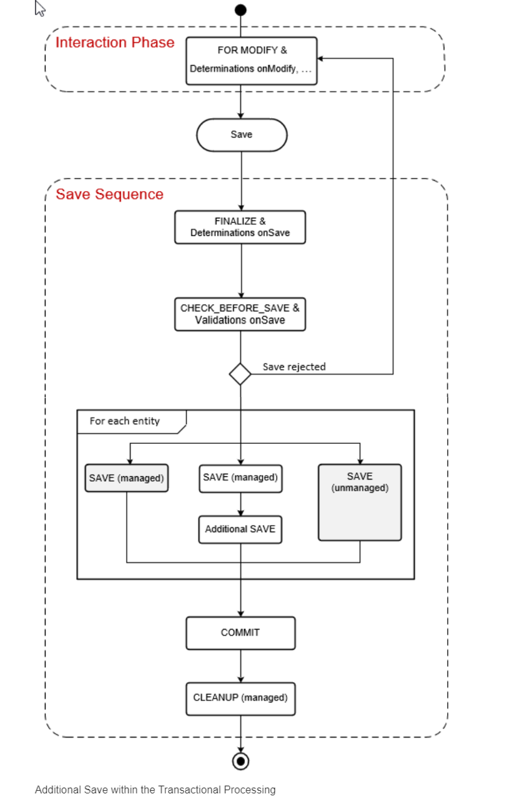

The save sequence is triggered for each business object after at least one successful modification (create, update, delete) was performed and saving data has been explicitly requested by the consumer. The save sequence starts with the **FINALIZE** processing step performing the final calculations and determinations before data changes can be persisted.

If the subsequent **CHECK_BEFORE_SAVE** call, including all onSave validations (validations with the trigger time on save), is positive for all transactional changes, the point-of-no-return is reached. From now on, a successful save is guaranteed by all involved BOs.

If, on the other hand, the result of the checks is negative at the time of **CHECK_BEFORE_SAVE**, a save is denied and the save sequence is interrupted. The consumer has now the option of modifying business object data and then trigger the save sequence again.

After the **point-of-no-return**, the save call persists all BO instance data from the transactional buffer in the database.

For each entity of an individual business object, the following options are available to execute the **SAVE** processing step:

•   **Managed save (default)**

•   **Managed save in conjunction with additional save**

•   **Unmanaged save (to prevent the managed runtime from saving the entities data)**

All change requests of the current LUW are committed. The actual save execution is finished by **COMMIT WORK**.

The final **CLEANUP** clears all transactional buffers of all business objects involved in the transaction.


### Syntax for Defining Additional Save for Each Individual Entity:

In general, an additional save can be defined for each entity of a given business object with managed implementation type. This is done in the behavior definition of the business object by adding the keyword with `additional save` - after specifying the `persistent table DB_TABLE`.

The actual implementation of an additional save is based on the ABAP language and takes place in a local saver class as a part of the behavior pool.

```

[implementation] managed;
define behavior for Entity [alias AliasedName]
implementation in class ABAP_ClASS [unique] 
persistent table DB_TABLE
with additional save
...
{
  ...
}

```

### Short Syntax for Defining Additional Save for All Entities

The following compact notation for defining the additional save is useful as an alternative if you want to define an additional save for all entities of a business object and the saver implementation is carried out in a single behavior pool **ABAP_CLASS**. In this case, the keyword `with additional save` is already specified in the header of the business object’s behavior definition.

```

[implementation] managed implementation in class ABAP_ClASS [unique] 
with additional save
define behavior for Entity [alias AliasedName]
persistent table DB_Table
...
{
  ...
}

```

1.	Open behavior definition `ZI_TRAVEL_M_XX`, the additional save is defined for the `travel` (root) entity, whereas for the `booking` child entity, the (default) managed save is defined.

```
managed implementation in class zcl_bp_travel_m_xx unique;

define behavior for ZI_TRAVEL_M_XX alias Travel
persistent table /dmo/travel
with additional save
…
{
  
…

  }

  define behavior for ZI_BOOKING_M_XX alias booking
  implementation in class zcl_bp_booking_m_xx unique
  persistent table /dmo/booking
…
  {
    ….


  }	

```

2.	Click the activation button or use the shortcut `Ctrl + F3` to activate the behavior definition.

3.  Open behavior implementation class `zcl_bp_travel_m_xx` **Local Types** as shown below and paste the below code at the end.


```

CLASS lcl_save DEFINITION INHERITING FROM cl_abap_behavior_saver.

  PROTECTED SECTION.
    METHODS save_modified REDEFINITION.

ENDCLASS.

CLASS lcl_save IMPLEMENTATION.

  METHOD save_modified.

    DATA lt_travel_log   TYPE STANDARD TABLE OF /dmo/log_travel.
    DATA lt_travel_log_c TYPE STANDARD TABLE OF /dmo/log_travel.
    DATA lt_travel_log_u TYPE STANDARD TABLE OF /dmo/log_travel.

    " (1) Get instance data of all instances that have been created
    IF create-travel IS NOT INITIAL.
      " Creates internal table with instance data
      lt_travel_log = CORRESPONDING #( create-travel ).

      LOOP AT lt_travel_log ASSIGNING FIELD-SYMBOL(<fs_travel_log_c>).
        <fs_travel_log_c>-changing_operation = 'CREATE'.

        " Generate time stamp
        GET TIME STAMP FIELD <fs_travel_log_c>-created_at.

        " Read travel instance data into ls_travel that includes %control structure
        READ TABLE create-travel WITH TABLE KEY entity COMPONENTS travel_id = <fs_travel_log_c>-travel_id INTO DATA(ls_travel).
        IF sy-subrc = 0.

          " If new value of the booking_fee field created
          IF ls_travel-%control-booking_fee = cl_abap_behv=>flag_changed.
            " Generate uuid as value of the change_id field
            TRY.
                <fs_travel_log_c>-change_id = cl_system_uuid=>create_uuid_x16_static( ) .
              CATCH cx_uuid_error.
                "handle exception
            ENDTRY.
            <fs_travel_log_c>-changed_field_name = 'booking_fee'.
            <fs_travel_log_c>-changed_value = ls_travel-booking_fee.
            APPEND <fs_travel_log_c> TO lt_travel_log_c.
          ENDIF.

          " If new value of the overal_status field created
          IF ls_travel-%control-status = cl_abap_behv=>flag_changed.
            " Generate uuid as value of the change_id field
            TRY.
                <fs_travel_log_c>-change_id = cl_system_uuid=>create_uuid_x16_static( ) .
              CATCH cx_uuid_error.
                "handle exception
            ENDTRY.
            <fs_travel_log_c>-changed_field_name = 'status'.
            <fs_travel_log_c>-changed_value = ls_travel-status.
            APPEND <fs_travel_log_c> TO lt_travel_log_c.
          ENDIF.

          " IF  ls_travel-%control-...

        ENDIF.

      ENDLOOP.

      " Inserts rows specified in lt_travel_log into the DB table /dmo/log_travel
      INSERT /dmo/log_travel FROM TABLE @lt_travel_log_c.

    ENDIF.


    " (2) Get instance data of all instances that have been updated during the transaction
    IF update-travel IS NOT INITIAL.
      lt_travel_log = CORRESPONDING #( update-travel ).

      LOOP AT update-travel ASSIGNING FIELD-SYMBOL(<fs_travel_log_u>).

        ASSIGN lt_travel_log[ travel_id = <fs_travel_log_u>-travel_id ] TO FIELD-SYMBOL(<fs_travel_db>).

        <fs_travel_db>-changing_operation = 'UPDATE'.

        " Generate time stamp
        GET TIME STAMP FIELD <fs_travel_db>-created_at.


        IF <fs_travel_log_u>-%control-customer_id = if_abap_behv=>mk-on.
          <fs_travel_db>-changed_value = <fs_travel_log_u>-customer_id.
          " Generate uuid as value of the change_id field
          TRY.
              <fs_travel_db>-change_id = cl_system_uuid=>create_uuid_x16_static( ) .
            CATCH cx_uuid_error.
              "handle exception
          ENDTRY.

          <fs_travel_db>-changed_field_name = 'customer_id'.

          APPEND <fs_travel_db> TO lt_travel_log_u.

        ENDIF.

        IF <fs_travel_log_u>-%control-description = if_abap_behv=>mk-on.
          <fs_travel_db>-changed_value = <fs_travel_log_u>-description.

          " Generate uuid as value of the change_id field
          TRY.
              <fs_travel_db>-change_id = cl_system_uuid=>create_uuid_x16_static( ) .
            CATCH cx_uuid_error.
              "handle exception
          ENDTRY.

          <fs_travel_db>-changed_field_name = 'description'.

          APPEND <fs_travel_db> TO lt_travel_log_u.

        ENDIF.

        "IF <fs_travel_log_u>-%control-...

      ENDLOOP.

      " Inserts rows specified in lt_travel_log into the DB table /dmo/log_travel
      INSERT /dmo/log_travel FROM TABLE @lt_travel_log_u.

    ENDIF.

    " (3) Get keys of all travel instances that have been deleted during the transaction
    IF delete-travel IS NOT INITIAL.
      lt_travel_log = CORRESPONDING #( delete-travel ).
      LOOP AT lt_travel_log ASSIGNING FIELD-SYMBOL(<fs_travel_log_d>).
        <fs_travel_log_d>-changing_operation = 'DELETE'.
        " Generate time stamp
        GET TIME STAMP FIELD <fs_travel_log_d>-created_at.
        " Generate uuid as value of the change_id field
        TRY.
            <fs_travel_log_d>-change_id = cl_system_uuid=>create_uuid_x16_static( ) .
          CATCH cx_uuid_error.
            "handle exception
        ENDTRY.

      ENDLOOP.

      " Inserts rows specified in lt_travel_log into the DB table /dmo/log_travel
      INSERT /dmo/log_travel FROM TABLE @lt_travel_log.

    ENDIF.

  ENDMETHOD.

ENDCLASS.

```

### Explanation of Saver Class

The implementation takes place in a local saver class as a part of the behavior pool. As depicted in the listing below, each such local class inherits from the base saver class **CL_ABAP_BEHAVIOR_SAVER**. This superclass provides the predefined method **save_modified** that needs to be redefined in the local saver class **lhc_saver**.

The following listing provides a template with the main steps for implementing unmanaged save within the save_modified method.

The essential elements of this method are the predefined, implicit parameters:

•	**CREATE-EntityName**

•	**UPDATE-EntityName**

•	**DELETE-EntityName**

These parameters contain not only the table type of the entity to be modified, but also the **%control** structure that can be used for identifying which elements have been changed during the current transaction. 

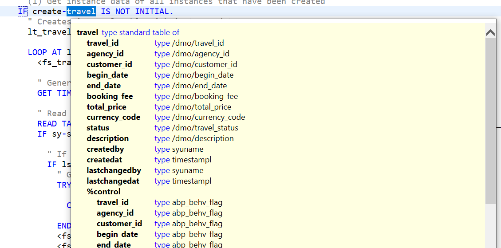

In this example, all essential changes to the root instance of the travel business object should be recorded in a log table. This is defined in such a way that it can hold different travel instance data and contains the change log fields.

In this example we use log table **/DMO/LOG_TRAVEL** which is already created with fields **change_id, travel_id, changing_operation, changed_field_name, changed_value and created_at**.

### Explanation of Source Code

The source code of our example implementation is divided into three sections:

Each of these sections is initiated with an IF statement, each of which checks whether

•	the travel instances have been created (IF create-travel IS NOT INITIAL),

•	their elements have been modified (IF update-travel IS NOT INITIAL), or

•	deleted (IF delete-travel IS NOT INITIAL) by a consumer.

The relevant instance data is written to the internal table **lt_travel_log** and passed to the log table for persistent storage on the database **(INSERT /dmo/log_travel...)**.

When creating new travel instances and updating instance data, the **%control** structure is used to get information on what fields have been provided or updated by the consumer. The **%control** structure contains a flag **if_abap_behv=>mk-on** for each field, which indicates whether the field was provided (or changed) by the consumer or not.

4. Click the activation button or use the shortcut `Ctrl + F3` to activate the behavior definition.

5. Open service binding `ZTRAVEL_PROC_SB_M_XX`. Click the `preview` button by selecting the Entity type or double click the entity in the service binding to check how the UI of a Fiori application looks like or refresh the browser where Fiori app is displayed to check the log functionality.

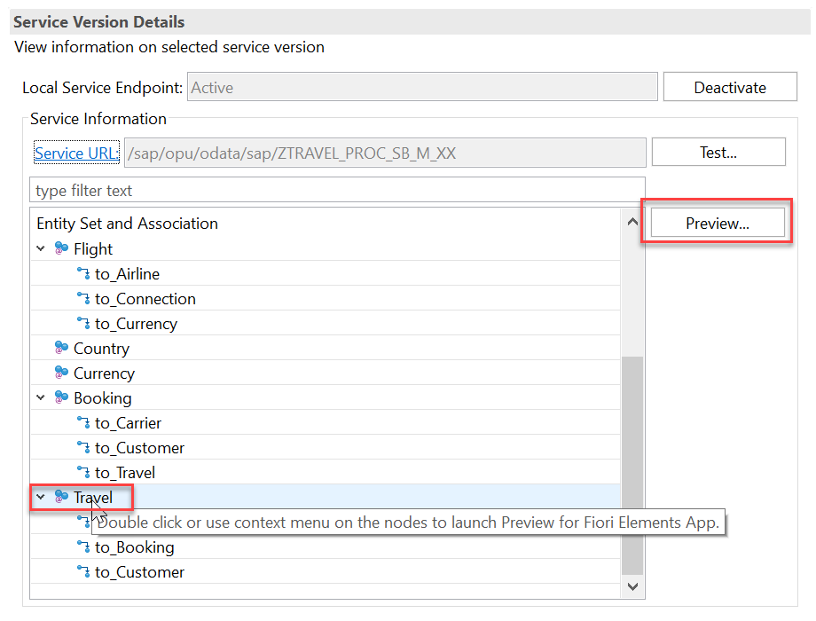

6. Create a new Travel using button `Create`.

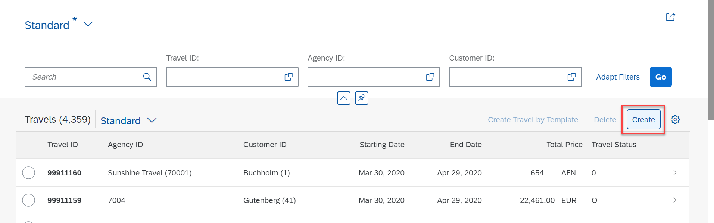

Give details as below and click and `Save`.

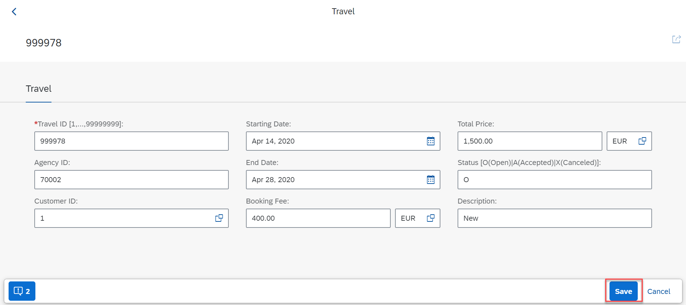

Travel instance will be created, and Log table will be updated as below:

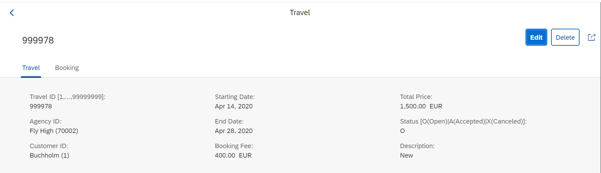

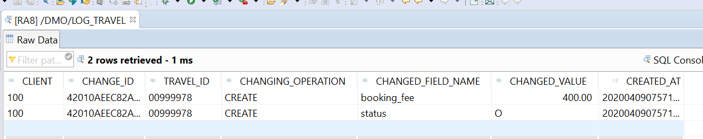

When creating instances, the new values for relevant fields of the travel entity are written into the internal table **lt_travel_log_c**. In our demo code, we select the two fields **booking_fee** and **overall_status** as an example. Their values are transferred as separate rows by means of **APPEND** into **lt_travel_log_c** and finally written into the log table **/dmo/log_travel** with **INSERT**.

7. Similarly, in the update case, we also select two fields, namely **customer_id** and **description**, as relevant fields for recording. So whenever the value of one of these fields is changed for an existing travel instance by a consumer, a new table row (with the corresponding change ID) is appended to the internal table **lt_travel_log_c**.

Open any Travel instance as shown below and change the customer id and description to log entries.

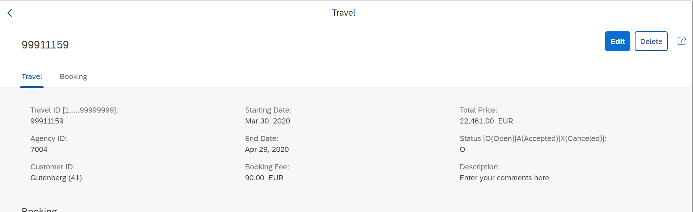

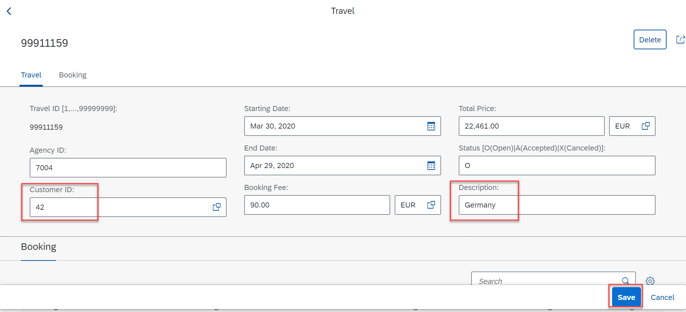

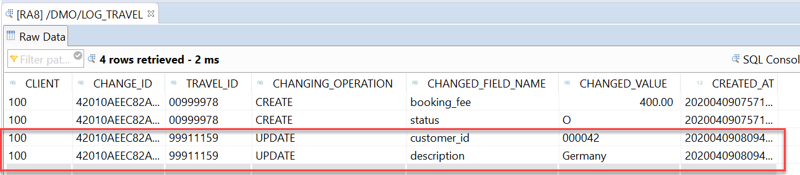

8. In the **deletion** of travel instances. However, in this case we are only interested in the information of which instances have been deleted. Therefore, there is no information of fields available when deleting instances.


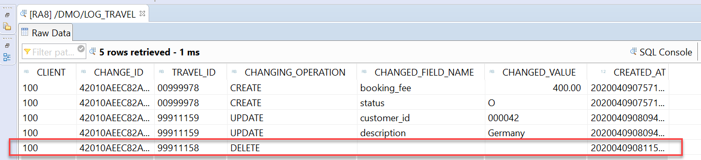

#### Solution 
Solution for this exercise can be found [here](https://github.wdf.sap.corp/DevelopmentLearning/restful-abap/blob/master/docs/Managed%20Implementation/AdditionalandUnManagedSave/Solutions/ZI_TRAVEL_M_XX.beh) and [here](https://github.wdf.sap.corp/DevelopmentLearning/restful-abap/blob/master/docs/Managed%20Implementation/AdditionalandUnManagedSave/Solutions/zcl_bp_travel_m_xx.abapclass)

<a id="exercise-2"></a>
# Exercise 2 - Integrating Unmanaged Save in Managed Business Objects

This section explains how you can integrate unmanaged save within the transactional life cycle of managed business object.

### Use Case

In certain use cases you might be requested to prevent business object’s managed runtime from saving business data (changes).

By default, the managed runtime saves all changed instances of business object’s entity in the database table that is specified as **persistent table DB_TABLE** in the behavior definition (managed save). However, you define for each entity of the business object or for the entire business object whether the complete save is done by the managed runtime or by the unmanaged save instead.

This implementation flavor of a managed scenario may be relevant to you if you need to implement the interaction phase for your application anyway, but the update task function modules are already available.

The following figure outlines the main components of business objects managed runtime that integrates function modules for persistent save of business data changes.

Within the interaction phase, a consumer calls the business object operations to change business data and read instances with or without the transactional changes. The business object runtime keeps the changes in its internal transactional buffer which represents the state of instance data. After all changes on the related entity were performed, the instance data can be persisted. This is realized during the save sequence. 

To prevent the managed runtime from saving the data, the function modules (for the update task) are called to save data changes of the relevant business object’s entity (unmanaged save). In order to persist the business data changes, the function modules access the corresponding tables of the HANA database.

Note that the behavior handler can also directly access table data from the database during the interaction phase: Authorization checks, for example, require direct access to the table data on the database.

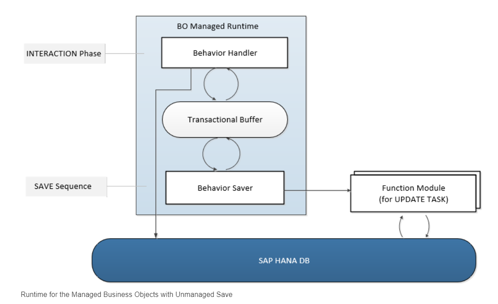

The following figure depicts the unmanaged save within the transactional life cycle of a managed business object.


### Syntax for Defining Unmanaged Save for Each Individual Entity

In general, unmanaged save can be defined for each entity of a given business object with managed implementation type. This is done in the behavior definition of the business object by adding the keyword **with unmanaged save**. 

Note that **persistent table DB_TABLE** does not apply in unmanaged save. In this case, a function module in update task is used for storing entity’s business data changes that result from the transactional life cycle.

```

[implementation] managed;
define behavior for Entity [alias AliasedName]
implementation in class ABAP_ClASS [unique] 
with unmanaged save
...
{
  ...      
}

```

### Short Syntax for Defining Unmanaged Save for All Entities

The following compact notation for defining the unmanaged save is useful as an alternative if you want to define an unmanaged save for all entities of a business object and the saver implementation is carried out in a single behavior pool **ABAP_CLASS**. 

In this case, the keyword **with unmanaged save** is already specified in the header of the business object’s behavior definition.

```
[implementation] managed;
with unmanaged save
define behavior for Entity [alias AliasedName]
implementation in class ABAP_ClASS [unique] 

...
{
  ...      
}

```

1.	Open behavior definition `ZI_TRAVEL_M_XX`, the additional save is defined for the `travel` (root) entity, whereas for the child entity `booking` the unmanaged save.

```

managed implementation in class zcl_bp_travel_m_xx unique;

define behavior for ZI_TRAVEL_M_XX alias Travel
persistent table /dmo/travel
with additional save
…
{
  …


  }

  define behavior for ZI_BOOKING_M_XX alias booking
  implementation in class zcl_bp_booking_m_xx unique
  //  persistent table /dmo/booking
  with unmanaged save
  …
  {

    ….

  }

```

Note that for unmanaged save persistent table syntax is not required and commented in the above syntax.

2.	Click the activation button or use the shortcut `Ctrl + F3` to activate the behavior definition.

3.  Open behavior implementation class `zcl_bp_travel_m_xx` **Local Types** as shown below and paste the below code in the save implementation class.

```

CLASS lcl_save IMPLEMENTATION.

  METHOD save_modified.
….

* ********************************************************************************
*
* Implements unmanaged save
*
********************************************************************************
    DATA lt_booking_db TYPE /dmo/t_booking.

    " (1) Get instance data of all instances that have been created
    IF create-booking IS NOT INITIAL.
      lt_booking_db = CORRESPONDING #( create-booking ).

      CALL FUNCTION 'Z_FLIGHT_BOOKING_C_XX' EXPORTING values = lt_booking_db.
    ENDIF.

    " (2) Get instance data of all instances that have been updated during the transaction
    IF update-booking IS NOT INITIAL.
      lt_booking_db = CORRESPONDING #( update-booking ).

" Read all field values from database
      SELECT * FROM /dmo/booking FOR ALL ENTRIES IN @lt_booking_db

               WHERE booking_id  = @lt_booking_db-booking_id
               AND travel_id = @lt_booking_db-travel_id
               INTO TABLE @lt_booking_db .

      " Take over field values that have been changed during the transaction
      LOOP AT update-booking ASSIGNING FIELD-SYMBOL(<ls_unmanaged_booking>).
        ASSIGN lt_booking_db[ travel_id  = <ls_unmanaged_booking>-travel_id
                                booking_id = <ls_unmanaged_booking>-booking_id

                       ] TO FIELD-SYMBOL(<ls_booking_db>).

        IF <ls_unmanaged_booking>-%control-flight_date = if_abap_behv=>mk-on.
          <ls_booking_db>-flight_date = <ls_unmanaged_booking>-flight_date.
        ENDIF.

        IF <ls_unmanaged_booking>-%control-flight_price = if_abap_behv=>mk-on.
          <ls_booking_db>-flight_price   = <ls_unmanaged_booking>-flight_price.
        ENDIF.

        IF <ls_unmanaged_booking>-%control-currency_code = if_abap_behv=>mk-on.
          <ls_booking_db>-currency_code = <ls_unmanaged_booking>-currency_code.
        ENDIF.

        IF <ls_unmanaged_booking>-%control-connection_id = if_abap_behv=>mk-on.
          <ls_booking_db>-connection_id = <ls_unmanaged_booking>-connection_id.
        ENDIF.

      ENDLOOP.

      " Update the complete instance data
      CALL FUNCTION 'Z_FLIGHT_BOOKING_U_XX' EXPORTING values = lt_booking_db .
    ENDIF.

    " (3) Get keys of all travel instances that have been deleted during the transaction
    IF delete-booking IS NOT INITIAL.
      lt_booking_db = CORRESPONDING #( delete-booking ).

      CALL FUNCTION 'Z_FLIGHT_BOOKING_D_XX' EXPORTING values = lt_booking_db .
    ENDIF.
  ENDMETHOD.
ENDCLASS.
```

### Explanation

The implementation takes place in a local saver class as a part of the behavior pool. As depicted in the listing below, each such local class inherits from the base saver class **CL_ABAP_BEHAVIOR_SAVER**. This superclass provides the predefined method **save_modified** that needs to be redefined in the local saver class **lhc_saver**.

The following listing provides a template with the main steps for implementing unmanaged save within the **save_modified** method.

The essential elements of this method are the predefined, implicit parameters:
•	**CREATE-EntityName**

•	**UPDATE-EntityName**

•	**DELETE-EntityName**

These parameters contain not only the table type of the entity to be modified, but also the **%control** structure that can be used for identifying which elements have been changed during the current transaction. 

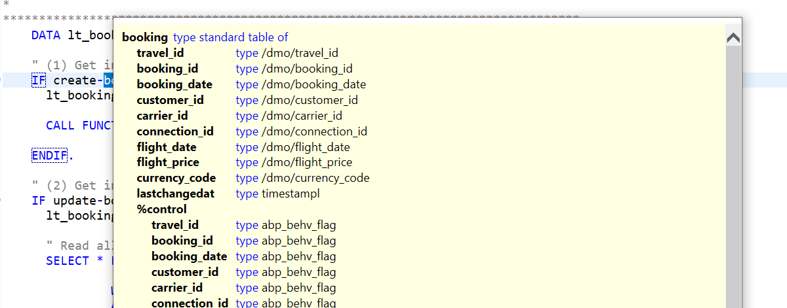

The above example shows you in detail how you can implement unmanaged save specifically based on our travel demo scenario. In particular, the previous implementation must be extended in such a way that the available function modules are used to save changes to business data of the booking child entity.

•	**Z_FLIGHT_BOOKING_C_XX**.

•	**Z_FLIGHT_BOOKING_U_XX**.

•	**Z_FLIGHT_BOOKING_D_XX**.


4.	Click the activation button or use the shortcut `Ctrl + F3` to activate the behavior definition.

5. Open service binding `ZTRAVEL_PROC_SB_M_XX`.
Click the `preview` button by selecting the Entity type or double click the entity in the service binding to check how the UI of a Fiori application looks like or refresh the browser where Fiori app is displayed.


6.	Create a new booking using button **Create**

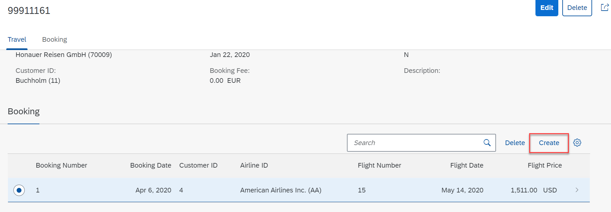

Give details as below and click and `Save`.

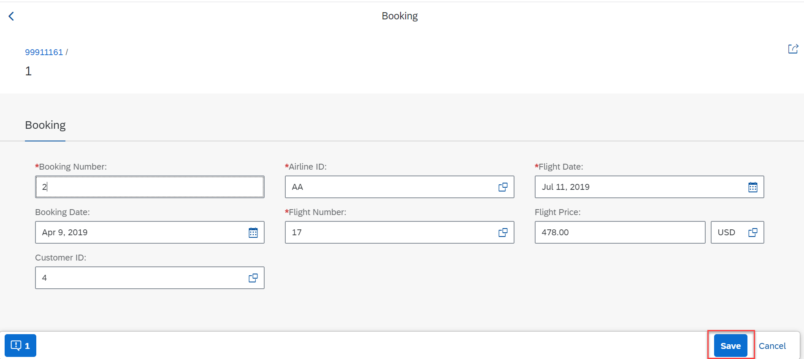

Travel instance will be created, and table `/dmo/booking` will be updated. 

Each of these sections is initiated with an IF statement, each of which checks whether the booking instances have been created, their elements have been modified, or deleted by a consumer. 

The relevant instance data is written to the internal table **lt_booksuppl_db** and passed to the respective function module for persistent storage on the database.


7. Open any booking instance as shown below and change the details as below:

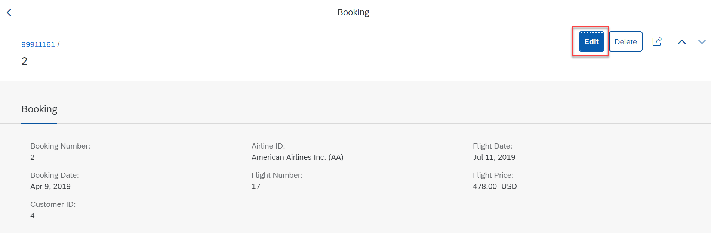


In case of updating instance data **(IF update-booking IS NOT INITIAL)**, the **%control** structure is used to get information on what fields have been updated by the consumer. The **%control** structure contains a flag **if_abap_behv=>mk-on** for each field, which indicates whether the field was provided (changed) by the consumer or not.

To eliminate the option that the unchanged fields are overwritten with default values, we must ensure that they are kept according to the database data. This is the reason why we read the current data set from the database using the statement **SELECT * FROM /dmo/booking FOR ALL ENTRIES IN @lt_booksuppl_db**.

8. In the deletion of travel instances. However, in this case we are only interested in the information of which instances have been deleted. Therefore, there is no information of fields available when deleting instances.

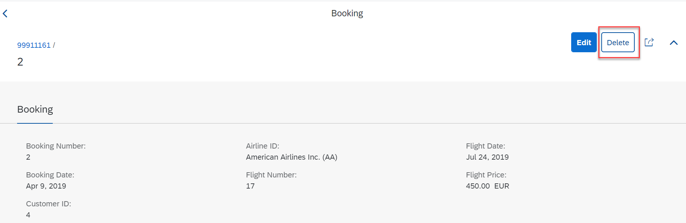


#### Solution 
Solution for this exercise can be found [here](https://github.wdf.sap.corp/DevelopmentLearning/restful-abap/blob/master/docs/Managed%20Implementation/AdditionalandUnManagedSave/Solutions/ZI_TRAVEL_M_XX.behav) and [here](https://github.wdf.sap.corp/DevelopmentLearning/restful-abap/blob/master/docs/Managed%20Implementation/AdditionalandUnManagedSave/Solutions/zcl_bp_travel_m_xx.class)
