# Developing Unmanaged Transactional Apps 
* [Technical Remarks](#remarks)
* [Exercise 1 - Providing CDS Data Model with Business Object Semantics](#exercise-1)
* [Exercise 2 - Defining Transactional Behavior of Business Objects](#exercise-2)
* [Exercise 3 - Implementing the Transactional Behavior of the Business Object](#exercise-3)
* [Exercise 4 - Implementing the Interaction Phase and the Save Sequence](#exercise-4)
* [Exercise 5 - Implementing the CREATE Operation for Travel Instances](#exercise-5)
* [Exercise 6 - Implementing the UPDATE Operation for Travel Data](#exercise-6)
* [Exercise 7 - Implementing the DELETE Operation for Travel Data](#exercise-7)
* [Exercise 8 - Implementing the SET_STATUS_BOOKED Action](#exercise-8)
* [Exercise 9 - Adding draft behaviour to Travel BO](#exercise-9)
* [Summary](#summary)

<a id="remarks"></a>
# Technical Remarks
This section explains the main development tasks required for enabling transactional processing in a business objects provider that integrates existing business logic.

The scenario described below focuses on an **unmanaged** implementation type of a business object provider in the context of the ABAP RESTful programming model.

For the **unmanaged** implementation type, the application developer must implement essential components of the REST contract itself. In this case, all required operations (create, update, delete, or any application-specific actions) must be specified in the corresponding behavior definition before they are manually implemented in ABAP.

In a **managed** implementation type, on the other hand, a behavior definition would on its own be sufficient to obtain a ready-to-run business object.

The application demo provided (which represents a legacy stateful application), allows a user to create and manipulate flights. It involves different data sources and entities such as `travel`, `travel agencies`, `customers (passengers)`, and `bookings`. Some of these are editable (that is, they can be created or manipulated) and some are not.

<a id="exercise-1"></a>
# Exercise 1 - Providing CDS Data Model with Business Object Semantics
The figure below shows the relationships between the `travel`, `agency` and `customer` entities where the travel entity represents the `root` of the data model. Additional entities for currencies `(I_Currency)` and countries `(I_Country)` are generally available in your system and are included in our data model using associations.

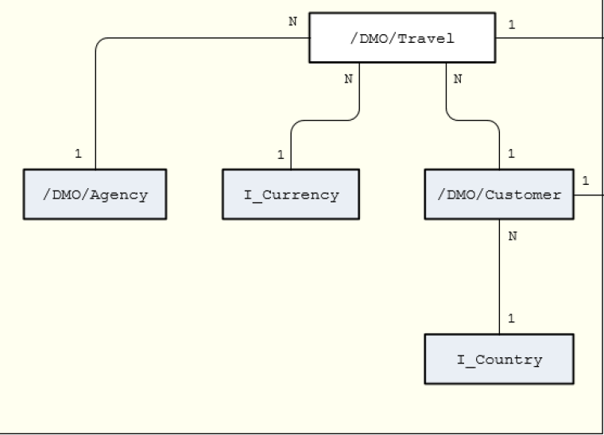

development of new business services by integrating the transactional behavior of an existing (legacy) application
  * `Travel` – root entity, editable yes, 
  * `Customer` - editable no, 1: n cardinality between Customer and Travel.
  * `Agency` - editable no,1: n cardinality between Agency and Travel.
  
  1.	The travel view defines the `root entity` of the data model and represents the root node of the corresponding (travel) business object. Add `root` syntax to Travel CDS view `ZI_TRAVEL_U_XX` (Replace XX with your initials), to open the CDS view you can use shortcut `Cltr + Shift + A` and give the CDS view name
  
  ```
@AccessControl.authorizationCheck: #CHECK
@UI.headerInfo.typeName: 'Travel'
@UI.headerInfo.typeNamePlural: 'Travels'
@EndUserText.label: 'Travel view - CDS data model'
define root view entity ZI_TRAVEL_U_XX…

```

2.	Click the activation button or use the shortcut `Ctrl + F3` to activate

<a id="exercise-2"></a>
# Exercise 2 - Defining Transactional Behavior of Business Objects

### Behavior Definition
* A business object `behavior definition` (behavior definition for short) is an ABAP Repository object that describes the behavior of a business object in the context of the ABAP RESTful programming model.
*	A behavior definition is defined using the Behavior Definition Language (BDL) and comprises capabilities and modelling aspects of the business object node or nodes, for example the supported operations (such as `create`, `update`, and `delete` `actions`) or the definition of `lock` dependencies between the parent and child nodes.
* A behavior definition always refers to a CDS data model. This reference results from the name equality with the root entity. This means that a CDS data model must always exist before the behavior definition is created.
* As shown in the figure below, a `behavior definition` relies directly on the CDS root entity.
*	One `behavior definition` refers exactly to one root entity and one CDS root entity has a maximum of one behavior definition (a 0..1 relationship), which also handles all associated (child) entities.
*	The implementation of a `behavior definition` can be done in a single ABAP class (behavior pool) or can be split between an arbitrary set of ABAP classes (behavior pools). You can assign any number of behavior pools to a behavior definition (a 1: n relationship).

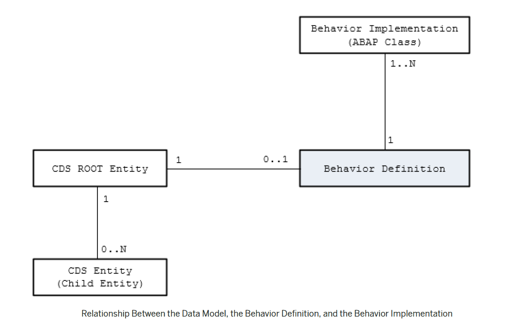

1.  Open CDS View `ZI_TRAVEL_U_XX`  (Replace XX with your initials) , to open the CDS view you can use shortcut `Cltr + Shift + A` and give the CDS view name.
2.  In the Project Explorer view of your ABAP project (or ABAP Cloud Project), select the node for the data definition that defines the root entity `(ZI_TRAVEL_U_XX)`  (Replace XX with your initials).

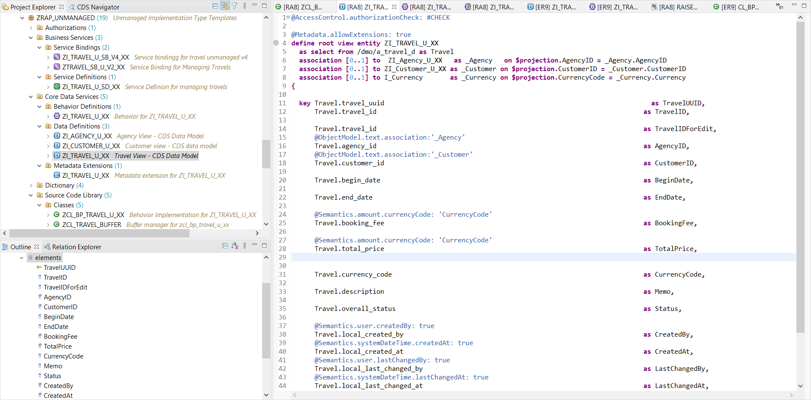

3. Open the context menu (Right click on CDS view name in Project Explorer) and choose `New Behavior Definition` to launch the creation wizard.

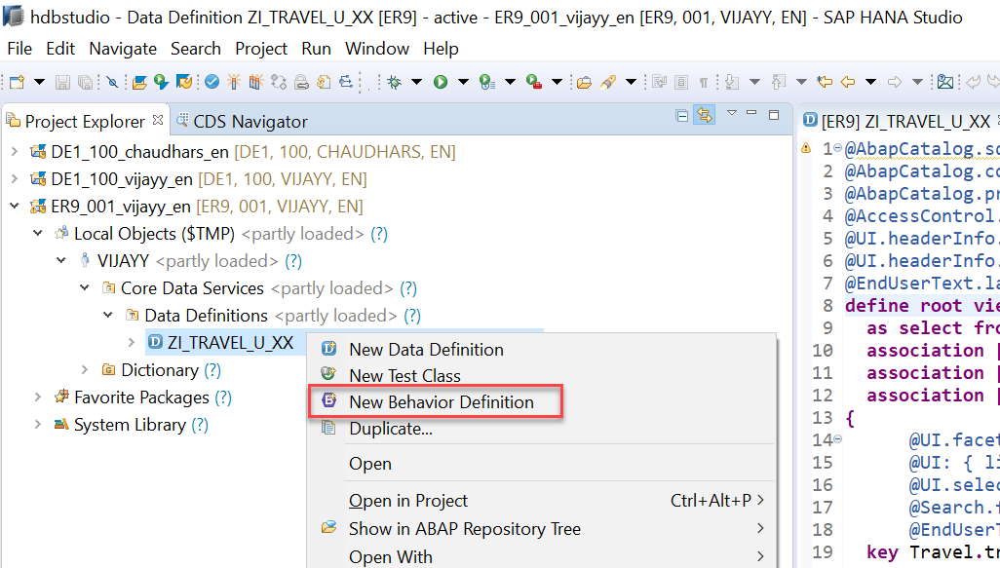

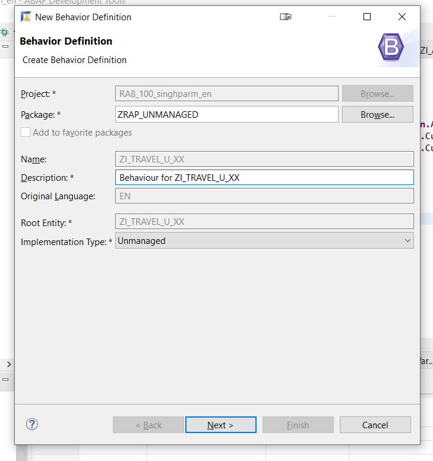

By creating a behavior definition, the referenced root entity and its compositions (in the upcoming versions of the programming model) gain a transactional character. The behavior definition is hence a realization of the `BO concept` within the context of the current programming model. All supported transactional operations of a concrete business object must be specified in the same behavior definition.

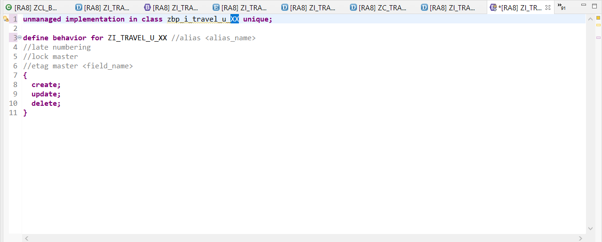

4.	The syntax of the Behavior Definition Language (BDL) is oriented to the Data Definition Language (DDL) used to define CDS entities (camel-case notation). Technically, the respective artifacts differ substantially: behavior definitions are managed in the ABAP compiler and not ABAP Dictionary. You use the following syntax to define the transactional behavior for a CDSEntity.

```
/* Header of behavior definition */
[implementation] managed | unmanaged | abstract | projection;

strict; 

[with draft];

/* Definition of entity behavior */
define behavior for CDSEntity [alias AliasName]

/* Entity properties */
[implementation in class ClASS_NAME unique]
[draft table DRAFT_TABLE]
[persistent table DB_TABLE]
[late numbering]
[etag {master Field | dependent by _Association}]
[lock {master Field | dependent by _Association}]
[authorization {master(instance)|dependent by _Association}] 

{
 /* Static field control */
 [field (readonly | mandatory) field1[, field2, ..., fieldn];]

 /* Standard operations */
 [internal] create;                  
 [internal] update;
 [internal] delete;
 
 /* draft actions */
  draft determine action Prepare;
  draft action Edit;
  draft action Activate;
  draft action Discard;
  draft action Resume;

 /* Actions */ 
 [internal] [static] [factory] action ActionName; 
        
/* Associations */ 
 association AssociationName [abbreviation AbbreviationName] {[create;]}

/* Mapping CDS view fields to db fields */
 mapping for DB_TABLE
 { CDSViewField1 = db_field1; 
   CDSViewField2 = db_field2; 
   ...
   CDSViewFieldn = db_fieldn; }
}
```
5.	The behavior definition looks quite easy in our case. Copy below code in the behavior definition editor:

Note that in the blow code snippet class name `zcl_bp_travel_u_xx` is changed and `alias travel`, `mapping syntax` are added. 

```
unmanaged implementation in class zcl_bp_travel_u_xx unique;
strict;

define behavior for ZI_TRAVEL_U_XX alias travel
//late numbering
lock master
authorization master ( instance )
//etag master <field_name>
{
  create;
  update;
  delete;

  action set_status_booked result [1] $self;
  
  mapping for /dmo/a_travel_d
  {
    TravelUUID    = travel_uuid;
    TravelID      = travel_id;
    AgencyID      = agency_id;
    CustomerID    = customer_id;
    BeginDate     = begin_date;
    EndDate       = end_date;
    BookingFee    = booking_fee;
    TotalPrice    = total_price;
    CurrencyCode  = currency_code;
    Memo          = description;
    Status        = overall_status;
    CreatedBy     = local_created_by;
    CreatedAt     = local_created_at;
    LastChangedBy = local_last_changed_by;
    LastChangedAt = local_last_changed_at;
  }
}

```

By Default class name will be generated. Change the class name `zcl_bp_travel_u_xx` (change xx to your initials) as below in the declaration:

```
unmanaged implementation in class zcl_bp_travel_u_xx unique;
```


* The header specifies the `unmanaged` implementation type of our business object provider since we are going to integrate the legacy business logic in the new app. Behavior implementation takes place in class `zcl_bp_travel_u_xx`.
*	The provider for our `TRAVEL` business object refers to the underlying CDS data model, which is represented by root entity `ZI_TRAVEL_U_XX` (Replace XX with your intitials) only.
*	The transactional behavior of the `TRAVEL` business object is determined by the standard operations `create`, `update`, and `delete`, and an instance-related `action` `set_status_booked`. Using this action, the end user is able to set the status of selected travel instances to booked.
*	Note that an action is always multi-instance capable. The action in our example affects the output instances with the same entity type and one input instance is related to exactly one output instance. Therefore, the output parameter is defined with  the predefined type `$self` and the cardinality [1].

6.	Click the activation button or use the shortcut `Ctrl + F3` to activate the behavior definition.

<a id="exercise-3"></a>
# Exercise 3 - Implementing the Transactional Behavior of the Business Object

### Behavior Pool

*	The transactional behavior of a business object in the context of the current programming model is implemented in a global ABAP class or classes. These special classes are dedicated only to implementing the business object’s behavior and are called `behavior pools`.
*	the implementation of a `behavior definition` can be done in one class or split across an arbitrary set of ABAP classes.
*	You can assign any number of behavior classes to a behavior definition (a 1: n relationship). Within a single global class, you can define multiple local classes that handle the business object’s behavior.
* The global class is just a container and is basically empty while the actual behavior logic is implemented in local classes.

In the below steps, you create a behavior pool that is the implementation artifact of the corresponding behavior definition that you created earlier in [Exercise-2](#exercise-2).

1. In your ABAP project (or ABAP Cloud Project), select the relevant behavior definition node `(ZI_TRAVEL_U_XX)` (Replace XX with your initials) in Project Explorer. 
To open the behavior definition you can use shortcut `Cltr + Shift + A` and give the Behavior definition name.

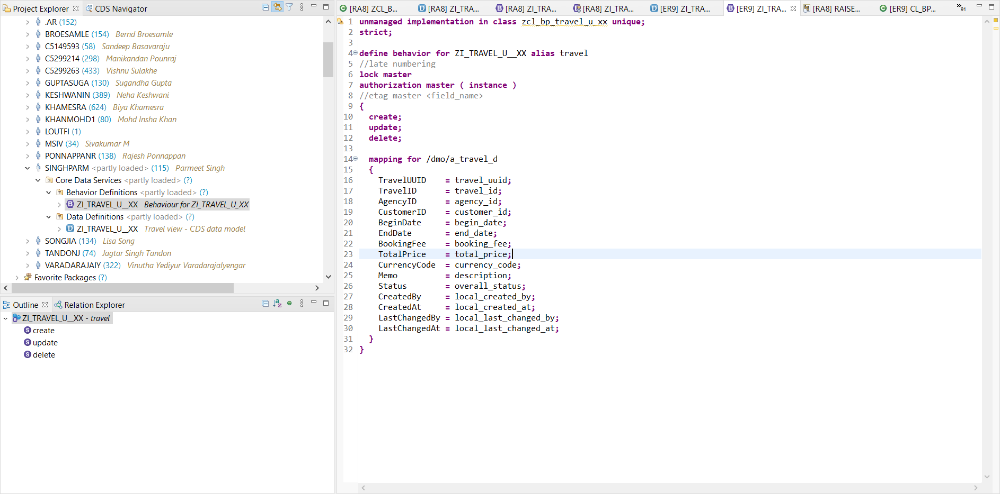

2. Place cursor at the class name and Press `Cltr + 1`.From the suggestions select `Create Behaviour Implementation class zcl_bp_travel_u_xx` to launch the creation wizard.

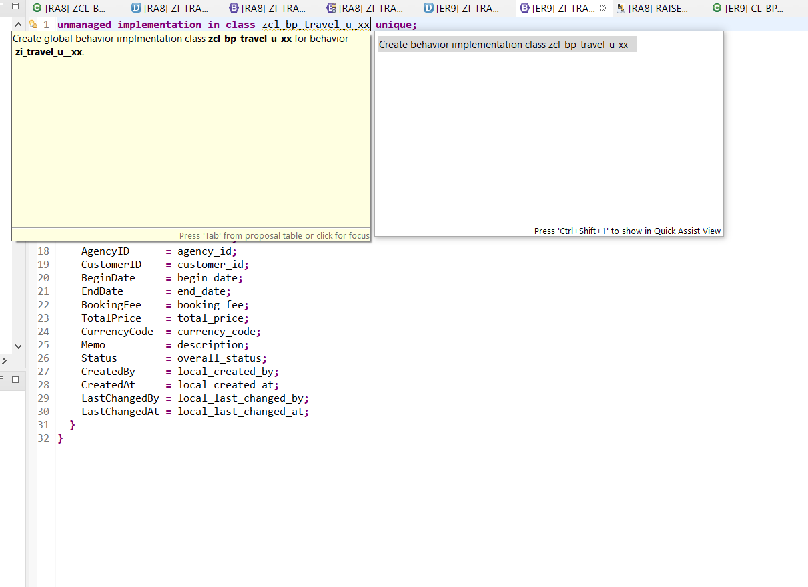

3.	Give Behavior implementation name as follows:

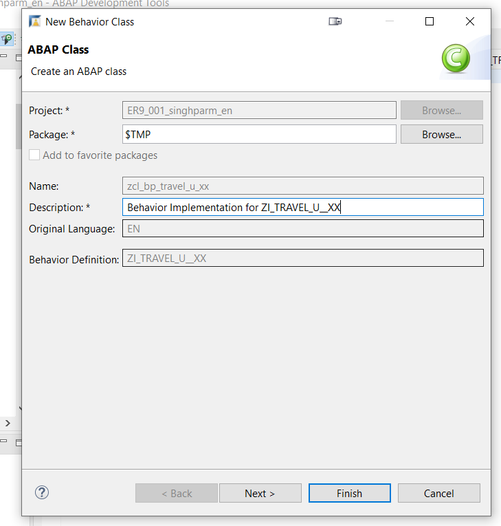

Click on Finish


4.	The generated class pool (in our case `ZCL_BP_TRAVEL_U_XX`) provides you with an extension `FOR BEHAVIOR`


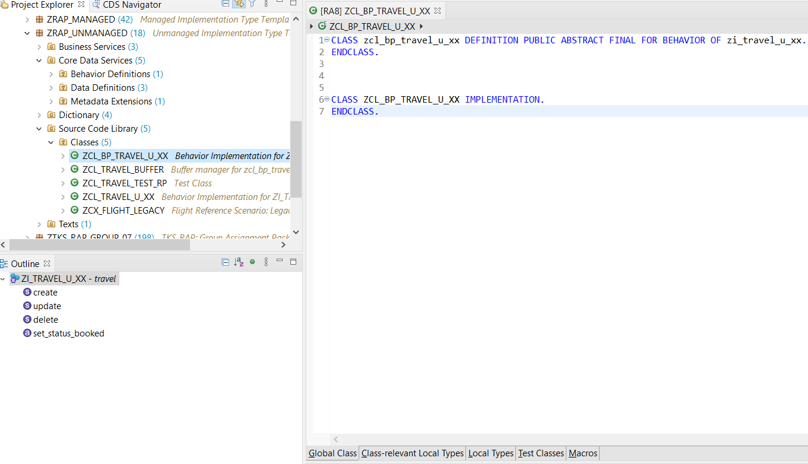

5.	Click on `Local Types` to see Skeleton of Local Classes Corresponding to the Behavior Model

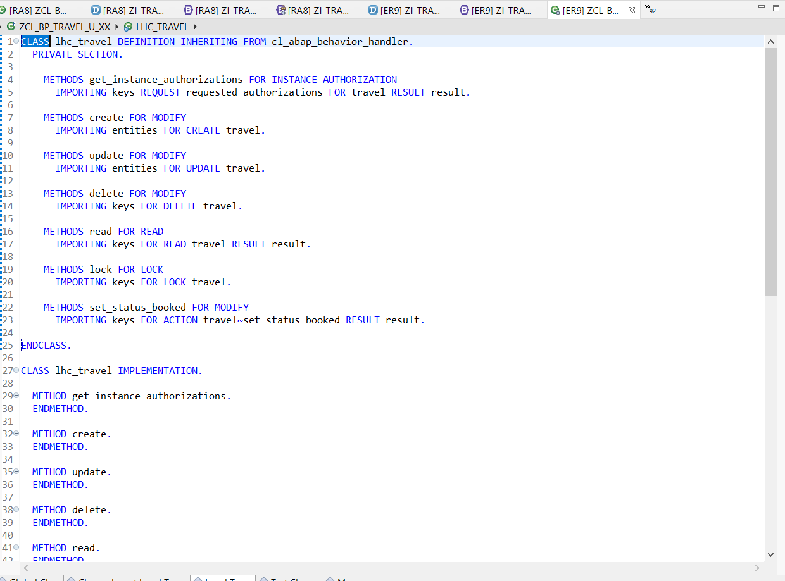

#### Explanation

Corresponding to the template for the root node behavior implementation, a local handler class lhc_travel is defined to implement each changing operation in one individual FOR MODIFY method. In this case, the `create FOR MODIFY` method should only be used to implement the create operation for root instances. Therefore, the signature of this method includes only one import parameter `entities` for referring to the travel (root) instances to be created. To identify the root entity, the alias `travel` is used - according to the alias that is specified in the behavior definition.

The local handler class `lhc_travel` inherits from class `cl_abap_behavior_handler` and is automatically instantiated by the framework.

Note that import parameter `entities` does not have fixed data type at the design time. At runtime, the data type is assigned by the compiler with the types derived from behavior definition.

<a id="exercise-4"></a>
# Exercise 4 - Implementing the Interaction Phase and the Save Sequence
The `business object` runtime has two parts:
1.	The first part is the `interaction phase` where a consumer calls business object operation to change data and read instances with or without the transactional changes. The business object keeps the changes in its internal transactional buffer, which represents the state. This transactional buffer is always required for a business object, regardless of how it is implemented.
2.	After all changes are performed, the data should be persisted. This is realized within the `save sequence`.

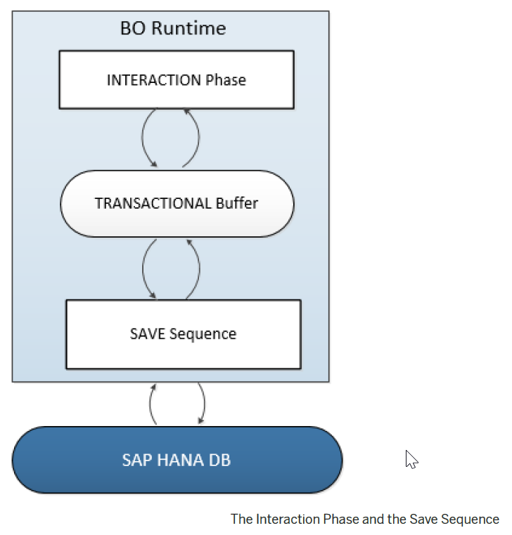

<a id="exercise-5"></a>
# Exercise 5 - Implementing the CREATE Operation for Travel Instances
In this topic, you will be guided through all implementation steps required for creation of new travel instances.

1.	To open the class `zcl_bp_travel_u_xx` (replace XX with your initials)  you can use shortcut `Cltr + Shift + A` and give the Class name
and click on `Local Types` Tab at the button of editor.
2. Before implementing the CREATE method, you need to add `get_uuid` method which will be called from the create method

Add the following in the definition part
```
      METHODS get_uuid
      RETURNING
        VALUE(r_result) TYPE zi_travel_u_xx-traveluuid.
```
Add the following in the implementation part
```
  METHOD get_uuid.
    TRY.
        r_result  = to_upper( cl_uuid_factory=>create_system_uuid( )->create_uuid_x16( ) ).
      CATCH cx_uuid_error.
        ASSERT 1 = 0.
    ENDTRY.
  ENDMETHOD.
```
3.	Implement the **CREATE** method with `entities` as importing parameter 

```
CLASS lhc_travel DEFINITION INHERITING FROM cl_abap_behavior_handler.
  PRIVATE SECTION.
      METHODS create FOR MODIFY
           IMPORTING entities FOR CREATE travel.
 ENDCLASS.
 …
 CLASS lhc_travel IMPLEMENTATION.
 …
  METHOD create.
    DATA lt_travel_create TYPE STANDARD TABLE OF /dmo/a_travel_d.

    LOOP AT entities INTO DATA(entity).

      DATA(lv_okay) = abap_true.

      " Perform some easy Business Logic - Here the full business logic needs to be called!
      IF entity-begindate > entity-enddate.

        lv_okay = abap_false.

        APPEND VALUE #( %cid = entity-%cid ) TO failed-travel.
        APPEND VALUE #( %cid = entity-%cid
                        %msg = NEW zcx_flight_legacy( textid = zcx_flight_legacy=>end_date_before_begin_date
                                                        begin_date = entity-begindate
                                                        end_date   = entity-enddate
                                                        travel_id  = entity-TravelID
                                                        severity = if_abap_behv_message=>severity-error )
                        %element-begindate = if_abap_behv=>mk-on
                        %element-enddate   = if_abap_behv=>mk-on ) TO reported-travel.
      ENDIF.

      IF entity-agencyid IS INITIAL.

        lv_okay = abap_false.

        APPEND VALUE #( %cid = entity-%cid ) TO failed-travel.
        APPEND VALUE #( %cid = entity-%cid
                        %msg = NEW zcx_flight_legacy( textid    = zcx_flight_legacy=>agency_unkown
                                                        agency_id = entity-AgencyID
                                                        severity  = if_abap_behv_message=>severity-error )
                        %element-agencyid = if_abap_behv=>mk-on ) TO reported-travel.
      ENDIF.

      IF entity-customerid IS INITIAL.


        lv_okay = abap_false.

        APPEND VALUE #( %cid = entity-%cid ) TO failed-travel.
        APPEND VALUE #( %cid = entity-%cid
                        %msg = NEW zcx_flight_legacy( textid    = zcx_flight_legacy=>customer_unkown
                                                        agency_id = entity-CustomerID
                                                        severity  = if_abap_behv_message=>severity-error )
                        %element-customerid = if_abap_behv=>mk-on ) TO reported-travel.
      ENDIF.

      IF lv_okay = abap_true.

        "Draw UUID if not provided externally
        IF entity-traveluuid IS INITIAL.
          entity-traveluuid = _get_uuid( ).
        ENDIF.

        " Set Local and Total ETag
        GET TIME STAMP FIELD entity-lastchangedat.

        APPEND CORRESPONDING #( entity MAPPING FROM ENTITY ) TO lt_travel_create.


        APPEND VALUE #( %cid       = entity-%cid
                        traveluuid = entity-traveluuid ) TO mapped-travel.
      ENDIF.

    ENDLOOP.

    zcl_travel_buffer=>get_instance(  )->set_mt_travel_create( lt_travel_create ).

  ENDMETHOD.
 ENDCLASS.
```
#### Explanation
A loop on all new travel instances to be created for the root node. Mapping the CDS view field names to the database table fields names by using the operator `MAPPING FROM ENTITY`.
Message handling for processing messages in case of failure. Each create action call can produce failed keys `(entity-%cid)` and messages `(lt_messages)`. Any failed keys are stored in the table `FAILED` whereas the `REPORTED` table includes all instance-specific messages.

Besides an ID of the relevant BO instance and the `%FAIL` component, the failed tables also include the predefined component `%CID`. It stands for the content ID and is used in an OData request to bind the result of an operation to a name so that it can be referenced in another operation later in the transactional processing.

In some use cases, it may happen that a consumer works with data that is not yet persisted and might not have a primary key yet. The primary key can be created in the `<method> FOR MODIFY` call or later in the save sequence (late numbering). In such cases, a temporary primary key, the content ID `(%CID)` for an instance, is used as long as no primary key was created by BO runtime. The content ID is consequently also used then as a foreign key.

In case of success `(lt_messages IS INITIAL)` , the two values with the content ID `%CID` and the new key `traveluuid` are written into the `mapped-travel` table.

The `MAPPED` tables comprise the components `%CID` and `%KEY`. They include the information about which key values were created by the application for given content IDs.

`zcl_travel_buffer=>get_instance(  )->set_mt_travel_create( lt_travel_create )` adds the travel instances to be created to a travel buffer.


4.	Performing Final Commit, When the `save` method is called, the final commit is executed on the database and the data entered by the user is persisted to the new travel instance.
The `save` method reads data from the buffer tables and performs the CRUD operation.

```
CLASS lsc_zi_travel_u_xx IMPLEMENTATION.
  ….

  METHOD save.
    DELETE /dmo/a_travel_d FROM TABLE @( zcl_travel_buffer=>get_instance(  )->get_mt_travel_delete(  ) ).
    INSERT /dmo/a_travel_d FROM TABLE  @( zcl_travel_buffer=>get_instance(  )->get_mt_travel_create(  ) ).
    UPDATE /dmo/a_travel_d FROM TABLE  @( zcl_travel_buffer=>get_instance(  )->get_mt_travel_update(  ) ).

  ENDMETHOD.
ENDCLASS.
```
5. To handle messages we will fill the table `failed-travel`
6.	Click the activation button or use the shortcut `Ctrl + F3` to activate.
7.	Click the `preview` button by selecting the Entity type or double click the entity in the service binding to check how the UI of a Fiori application looks like or refresh the browser where Fiori app is displayed.

To open the service binding `ZTRAVEL_SB_U_V2_XX` (Replace XX with your initials)  you can use shortcut `Cltr + Shift + A` and give the service binding name.

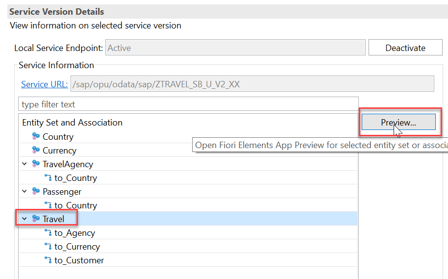

8.	Internet browser opens the `Travel` Fiori app. Press the `GO` button to retrieve data.

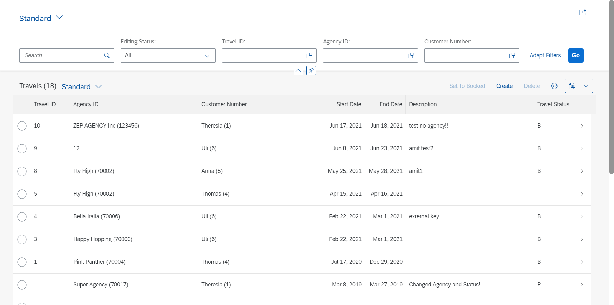

9.	To create a travel item, the end user must click the `+` icon and edit all required fields in the related object page to specify the required information for a new travel instance.

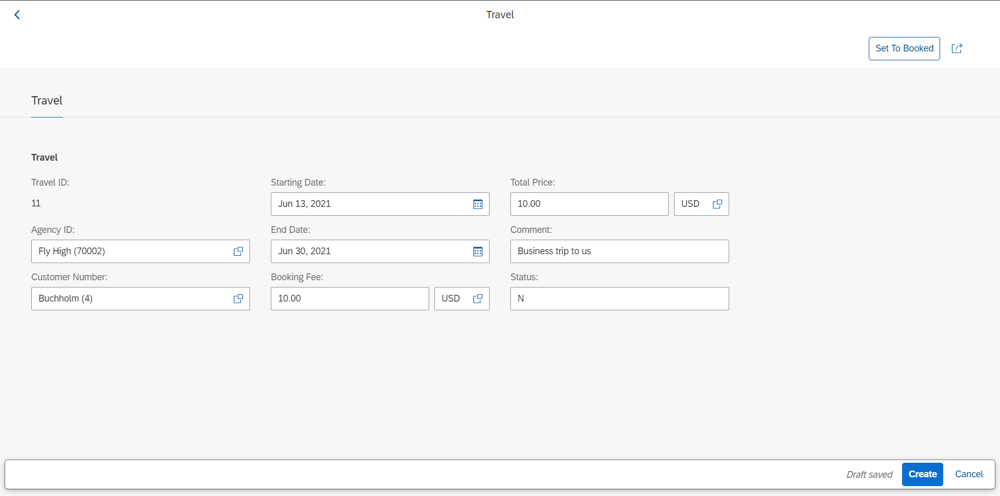

10.	As soon as the user clicks the `Save` button on the object page, the data is persisted in the corresponding database table and a travel instance with a new travel ID is created.

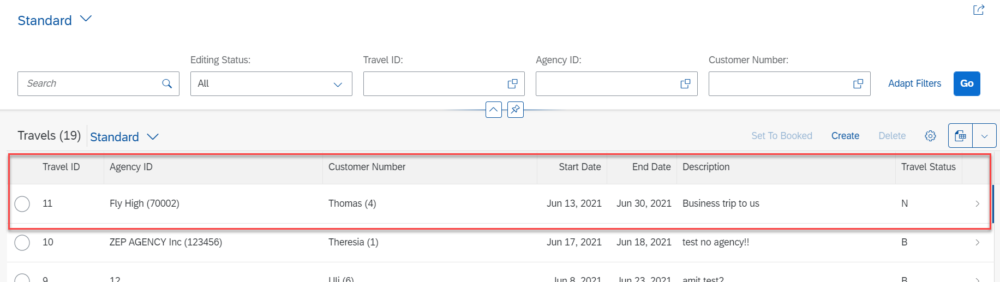

#### Solution 
Solution for this exercise can be found [here](/docs/Unmanaged%20Implementation/DevelopingUnmanagedTransactionalApp/Solutions/Exercise-5.abap)

<a id="exercise-6"></a>
# Exercise 6 - Implementing the UPDATE Operation for Travel Data
Below steps guide you through the implementation steps required for data updates to an existing travel instance.

1. Implement the **UPDATE** Method: 

2. `entities` is the importing parameter again.

```

CLASS lhc_travel DEFINITION INHERITING FROM cl_abap_behavior_handler.
  PRIVATE SECTION.
..
   METHODS update FOR MODIFY
      IMPORTING entities FOR UPDATE travel.

    LOOP AT entities INTO DATA(entity).

CLASS lhc_travel IMPLEMENTATION.
…
 METHOD update.

    DATA lt_travel_update TYPE TABLE FOR UPDATE zi_travel_u_xx.

    READ ENTITIES OF zi_travel_u_xx IN LOCAL MODE
     ENTITY travel
       ALL FIELDS WITH CORRESPONDING #( entities )
     RESULT DATA(lt_travel).

    LOOP AT entities INTO DATA(entity).

      READ TABLE lt_travel INTO DATA(ls_travel) WITH KEY entity COMPONENTS traveluuid = entity-traveluuid.

      IF sy-subrc = 0.

        DATA(lv_okay) = abap_true.

        ls_travel = CORRESPONDING #( BASE ( ls_travel ) entity USING CONTROL ).

        APPEND VALUE #( %tky        = entity-%tky
                        %state_area = 'BEGINENDDATE' ) TO reported-travel.

        " Perform some easy Business Logic
        IF ( entity-%control-begindate = if_abap_behv=>mk-on OR
             entity-%control-enddate   = if_abap_behv=>mk-on ) AND
           ( ls_travel-begindate > ls_travel-enddate ).

          lv_okay = abap_false.

          APPEND VALUE #( %tky = entity-%tky ) TO failed-travel.
          APPEND VALUE #( %tky = entity-%tky
                          %msg = NEW zcx_flight_legacy( textid = zcx_flight_legacy=>end_date_before_begin_date
                                                          begin_date = entity-begindate
                                                          end_date   = entity-enddate
                                                          travel_id  = entity-TravelID
                                                          severity = if_abap_behv_message=>severity-error )
                          %element-begindate = if_abap_behv=>mk-on
                          %element-enddate   = if_abap_behv=>mk-on
                          %state_area        = 'BEGINENDDATE' ) TO reported-travel.
        ENDIF.

        IF entity-%control-agencyid = if_abap_behv=>mk-on AND entity-agencyid IS INITIAL.

          lv_okay = abap_false.

          APPEND VALUE #( traveluuid = entity-traveluuid ) TO failed-travel.
          APPEND VALUE #( traveluuid = entity-traveluuid
                          %msg = NEW zcx_flight_legacy( textid    = zcx_flight_legacy=>agency_unkown
                                                          agency_id = entity-AgencyID
                                                          severity  = if_abap_behv_message=>severity-error )
                          %element-agencyid = if_abap_behv=>mk-on ) TO reported-travel.
        ENDIF.

        IF entity-%control-customerid = if_abap_behv=>mk-on AND entity-customerid IS INITIAL.

          lv_okay = abap_false.

          APPEND VALUE #( traveluuid = entity-traveluuid ) TO failed-travel.
          APPEND VALUE #( traveluuid = entity-traveluuid
                          %msg = NEW zcx_flight_legacy( textid    = zcx_flight_legacy=>customer_unkown
                                                          agency_id = entity-CustomerID
                                                          severity  = if_abap_behv_message=>severity-error )
                          %element-customerid = if_abap_behv=>mk-on ) TO reported-travel.
        ENDIF.


        IF lv_okay = abap_true.

          "Update Local and Total ETag
          GET TIME STAMP FIELD ls_travel-lastchangedat.

          APPEND CORRESPONDING #( ls_travel ) TO lt_travel_update.

        ENDIF.


      ELSE.

        APPEND VALUE #( traveluuid = entity-traveluuid ) TO failed-travel.
        APPEND VALUE #( traveluuid = entity-traveluuid
                        %msg = NEW zcx_flight_legacy( textid     = zcx_flight_legacy=>travel_unknown
                                                        travel_id  = ls_travel-TravelID
                                                        severity   = if_abap_behv_message=>severity-error )
                        %element-traveluuid = if_abap_behv=>mk-on ) TO reported-travel.
      ENDIF.

    ENDLOOP.
    zcl_travel_buffer=>get_instance(  )->set_mt_travel_update( CORRESPONDING #( lt_travel_update MAPPING FROM ENTITY ) ).
  ENDMETHOD.
```

#### Explanation

The basic structure of the FOR MODIFY method implementation is very similar to that of the handler class for creation of travel instances:

- Read existing data using  `READ ENTITIES ...` EML syntax.

- A loop on all new travel instances to be updated for the root node.

- Mapping of update entity using Control.

- Message handling for processing messages in case of failure.

Each update call can produce failed keys and messages (lt_messages). Failed keys are addressed by the content ID (entity-%cid_ref) and the value entity-travelid). In case of failure, failed keys are saved in the failed-travel table, whereas the reported-travel table includes all instance-specific messages.

3.	Click the activation button or use the shortcut `Ctrl + F3` to activate.
4.	Click the `preview` button by selecting the Entity type or double click the entity in the service binding to check how the UI of a Fiori application looks like or refresh the browser where Fiori app is displayed.

To open the service binding `ZTRAVEL_SB_U_V2_XX` (Replace XX with your initials) you can use shortcut `Cltr + Shift + A` and give the service binding name.


5.	Internet browser opens the Travel Fiori app. Give `Agency ID: 70007`, `Customer ID: 145` in the filters and Press the `GO` button to retrieve travel data which you want to update, click on travel item to navigate object page.

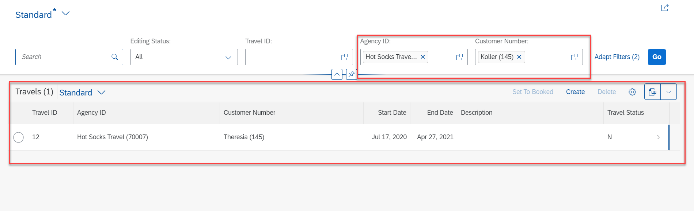

6.	In change mode, the end user is able to change the relevant travel fields as shown in the figure below.

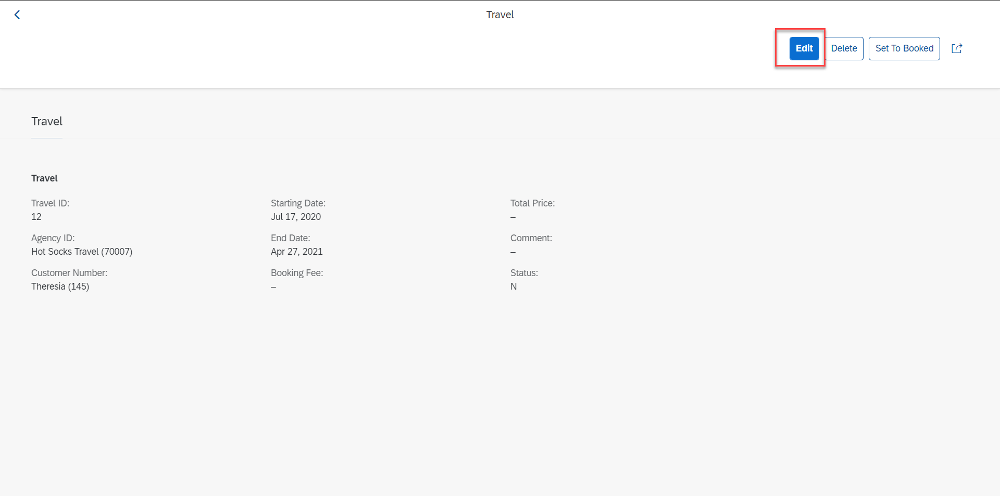

7.	Edit fields as below and click on `Save` button

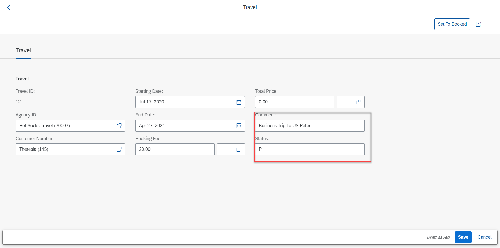

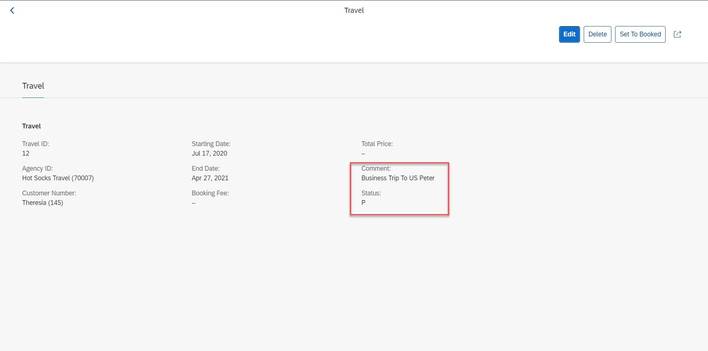

#### Solution 
Solution for this exercise can be found [here](/docs/Unmanaged%20Implementation/DevelopingUnmanagedTransactionalApp/Solutions/Exercise-6.abap)


<a id="exercise-7"></a>
# Exercise 7 - Implementing the DELETE Operation for Travel Data
Below steps guides you through the implementation steps required to delete an existing travel instance.

1. In case of delete only keys are passed to Delete method
2. `keys` is the importing parameter
3.	Implement the **DELETE** Method: 

```
CLASS lhc_travel IMPLEMENTATION.
   DATA lt_travel_delete TYPE STANDARD TABLE OF /dmo/a_travel_d.

    READ ENTITIES OF zi_Travel_u_xx IN LOCAL MODE
      ENTITY travel
        ALL FIELDS WITH CORRESPONDING #( keys )
      RESULT DATA(lt_travel).


    LOOP AT keys INTO DATA(key).

      READ TABLE lt_travel INTO DATA(ls_travel) WITH KEY entity COMPONENTS traveluuid = key-traveluuid.

      IF sy-subrc = 0.

        APPEND VALUE #( travel_uuid = key-traveluuid ) TO lt_travel_delete.
        "Clear state area for instance
        APPEND VALUE #( traveluuid  = ls_travel-traveluuid
                        %state_area = if_abap_behv=>state_area_all ) TO reported-travel.
      ELSE.
        APPEND VALUE #( traveluuid = ls_travel-traveluuid ) TO failed-travel.
        APPEND VALUE #( traveluuid = ls_travel-traveluuid

                        %msg = NEW zcx_flight_legacy( textid     = zcx_flight_legacy=>travel_unknown
                                                        travel_id  = ls_travel-TravelID
                                                        severity   = if_abap_behv_message=>severity-error )
                        %element-traveluuid = if_abap_behv=>mk-on ) TO reported-travel.
      ENDIF.

    ENDLOOP.
    zcl_travel_buffer=>get_instance(  )->set_mt_travel_delete( lt_travel_delete ).

  ENDMETHOD.

ENDCLASS.
```


Each delete operation call can produce failed keys and messages (lt_messages). Failed keys are addressed by the content ID (ls_travel-%cid_ref) and the key value ls_travel-travel_id). In case of failure, failed keys are saved in the failed-travel table, whereas the reported-travel table includes all instance-specific messages.

3.	Click the activation button or use the shortcut `Ctrl + F3` to activate.
4.	Click the `preview` button by selecting the Entity type or double click the entity in the service binding to check how the UI of a Fiori application looks like or refresh the browser where Fiori app is displayed.

To open the service binding `ZTRAVEL_SB_U_V2_XX` (Replace XX with your initials) you can use shortcut `Cltr + Shift + A` and give the service binding name.


5.	Internet browser opens the `Travel` Fiori app. Give `Agency ID: 70007`, `Customer ID: 145` in the filters and Press the `GO` button to retrieve travel data which you want to delete, select the radio button of the item and click on `Delete` button.

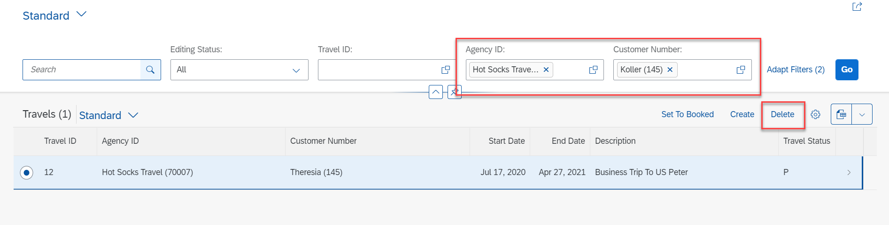
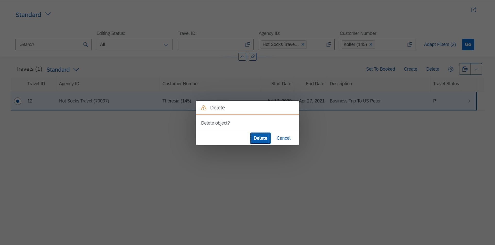
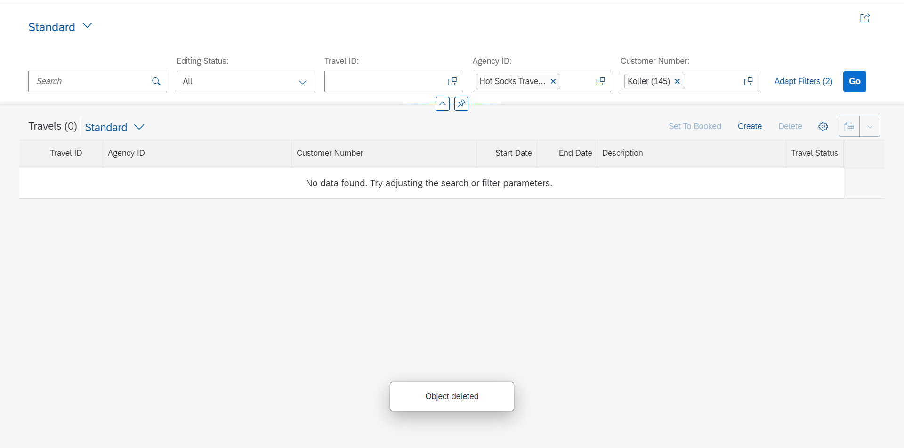

#### Solution 
Solution for this exercise can be found [here](/docs/Unmanaged%20Implementation/DevelopingUnmanagedTransactionalApp/Solutions/Exercise-7.abap)

<a id="exercise-8"></a>
# Exercise 8 - Implementing the SET_STATUS_BOOKED Action
Below steps describes the implementation of an action related to the travel instances. Using this action, the end user should be able to change the status of travel processing.
1.	Adding a Type Definition for Import and Export Parameters Required for the `Action` `SET_STATUS_BOOKED`

The actions are defined for `MODIFY` method using the following syntax:
```
METHODS set_status_booked FOR MODIFY IMPORTING import_parameter 
FOR ACTION entity~set_status_booked [RESULT action_export_parameter].

```

```
CLASS lhc_travel DEFINITION INHERITING FROM cl_abap_behavior_handler.
  PRIVATE SECTION.
...
    METHODS set_status_booked FOR MODIFY IMPORTING keys FOR ACTION travel~set_status_booked RESULT result.
ENDCLASS.
```

The beginning of the source code  in the above shows the declaration of two table types, one `FOR ACTION IMPORT` (the importing parameter) and the other `FOR ACTION RESULT` (the exporting parameter).

The import_parameter is a freely selected name (in our case: `keys`). The action_name refers to the name of an action defined in the behavior definition. The action_export_parameter is also a freely selected name (in our case: `result`).

The row type of the import_parameter table contains the following data:
* `%CID_REF` (the reference content ID)
* ID fields (here, `TRAVELID`)

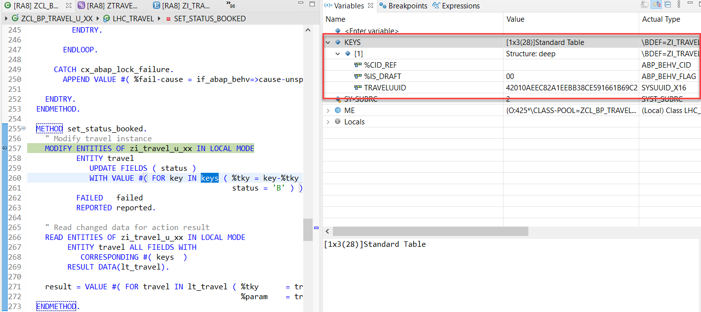

2.	Implementing the Action Handling

```

CLASS lcl_handler IMPLEMENTATION.
   METHOD set_status_booked.

    " Modify travel instance
    MODIFY ENTITIES OF zi_travel_u_xx IN LOCAL MODE
           ENTITY travel
              UPDATE FIELDS ( status )
              WITH VALUE #( FOR key IN keys ( %tky = key-%tky
                                              status = 'B' ) ) "Booked
           FAILED   failed
           REPORTED reported.

    " Read changed data for action result
    READ ENTITIES OF zi_travel_u_xx IN LOCAL MODE
         ENTITY travel ALL FIELDS WITH
            CORRESPONDING #( keys  )
         RESULT DATA(lt_travel).

    result = VALUE #( FOR travel IN lt_travel ( %tky      = travel-%tky
                                                %param    = travel ) ).
  ENDMETHOD.
ENDCLASS.
```

Each action call can produce failed keys and messages. Failed keys are saved in the table `failed-travel`. 

3.	Click the activation button or use the shortcut `Ctrl + F3` to activate the class.
4.	To add custom button `Set to Booked` in the Fiori app add below annotations to the TravelID field in the metadata extension.

```
@UI: { lineItem:       [ { 
                            position: 10, 
                            importance: #HIGH ,
                            label: 'Travel ID'},
                            { type: #FOR_ACTION, dataAction: 'set_status_booked', label: 'Set To Booked' } 
                         ],
         identification: [ { position: 10 },
                           { type: #FOR_ACTION, dataAction: 'set_status_booked', label: 'Set To Booked' } 
                         ],
         selectionField: [ { position: 10 } ] }
  @EndUserText.quickInfo: 'Travel Identification for Customer.'
  @Search.defaultSearchElement: true
  TravelID;
```
Open the metadata extension `zi_travel_u_XX` (Replace XX with your initials)  you can use shortcut `Cltr + Shift + A` and give the CDS view name.

 `type: #FOR_ACTION` represents status field has action enable,  `dataAction: 'set_status_booked'` represents action name specified in the behavior definition and `label: 'Set to Booked'` represents label for action button.
 
 5.	Click the activation button or use the shortcut `Ctrl + F3` to activate the Travel CDS view.
 6.	Click the `preview` button by selecting the Entity type or double click the entity in the service binding to check how the UI of a Fiori application looks like or refresh the browser where Fiori app is displayed.
 
To open the service binding `ZTRAVEL_SB_U_V2_XX` you can use shortcut `Cltr + Shift + A` and give the service binding name.


7.	Internet browser opens the `Travel` Fiori app and click on `Go` button to retrieve the travel data. You can see below `Set to Booked` disabled.

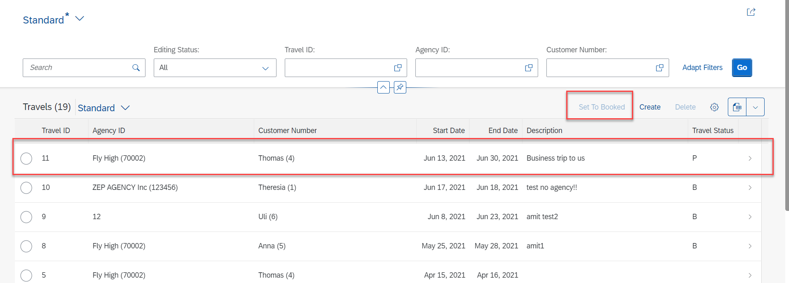

8.	Select the radio button for the travel data for which you wanted to change the status to Booked Then `Set to Booked` button will enable, click on it to changes the status to Booked.

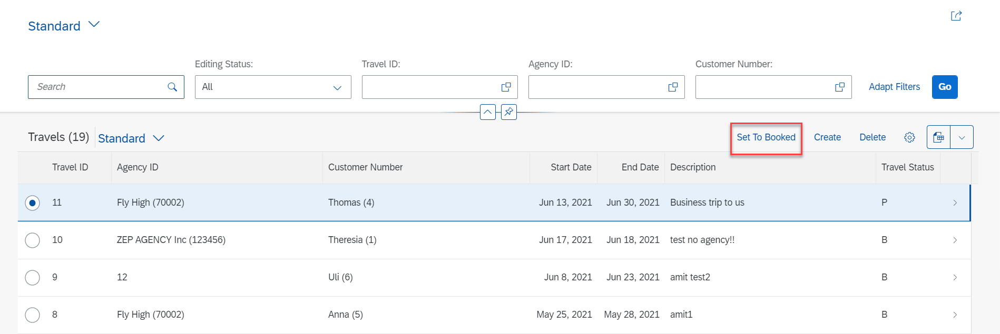

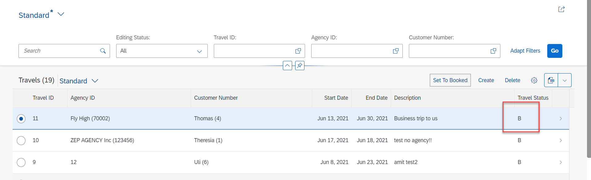

#### Solution 
Solution for this exercise can be found [here](/docs/Unmanaged%20Implementation/DevelopingUnmanagedTransactionalApp/Solutions/Exercise-8.abap)

<a id="exercise-9"></a>
# Exercise 9 - Adding draft behaviour to Travel BO

1. Open the behaviour definition ZI_TRAVEL_U_XX (replace xx with your initials)

2. Add the following lines in the behaviour definition.
```
strict;
with draft;
define behavior for ZI_TRAVEL_U_XX alias travel draft table zdtravel_u_xx
...
lock master total etag LastChangedAt
...
```
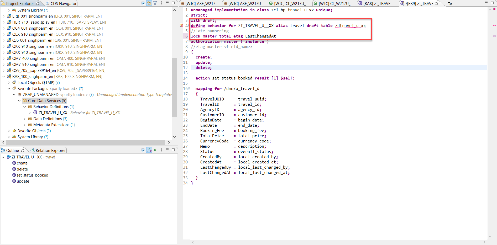
3. press ctrl + space on this line to generate new draft table
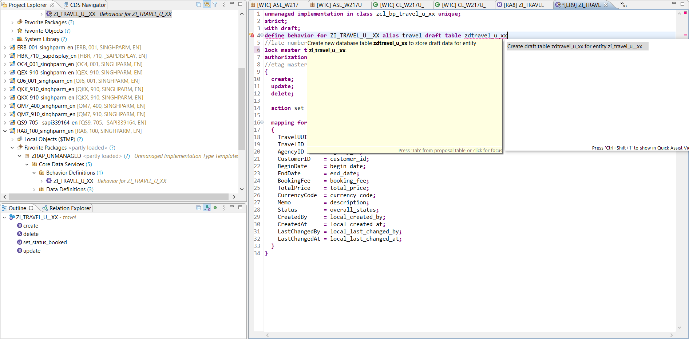
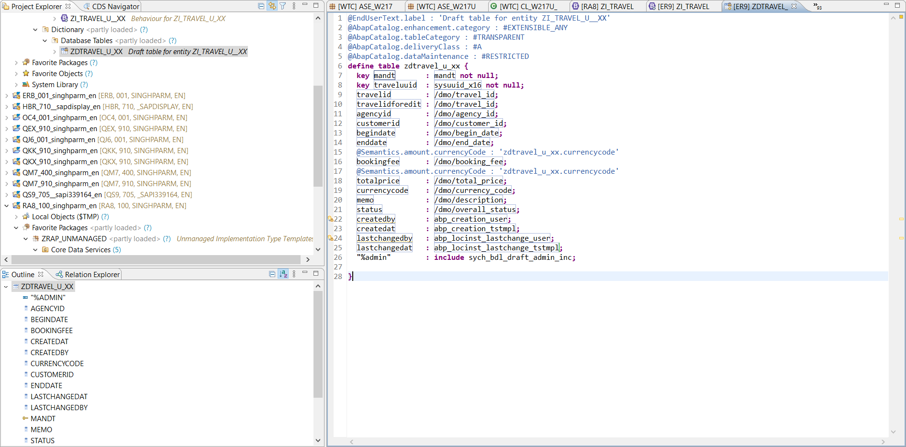
4. click on activate all button
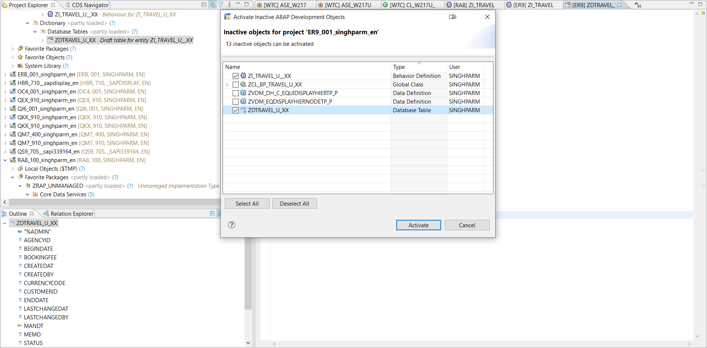
5. Following error is seen in Behaviour Definition
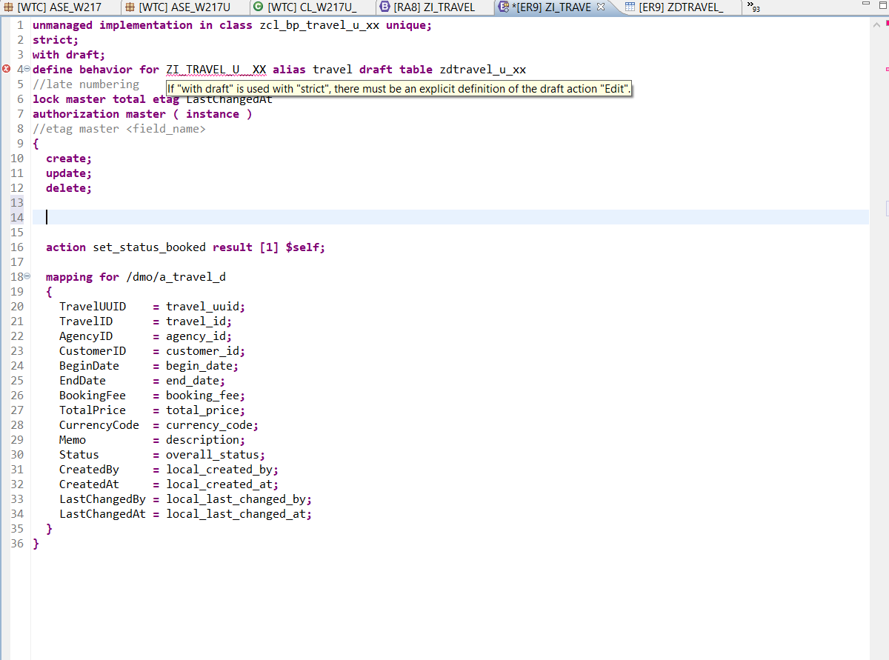
6. add following lines to remove the error in Behaviour definition . These are predefined actions for draft. Press F1 to get documentation of each action.
```
draft determine action Prepare;
  draft action Edit;
  draft action Activate;
  draft action Discard;
  draft action Resume;
```

7. add numbering managed for TRAVELUUID field 
```
  field ( numbering : managed ) TravelUUID;

```
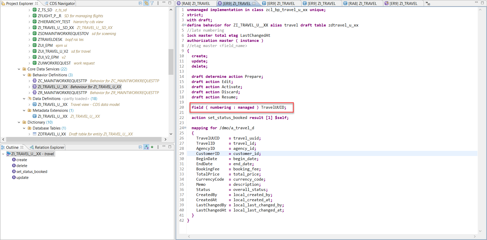
Solution for this exercise can be found [Behaviour definition](/docs/Unmanaged%20Implementation/DevelopingUnmanagedTransactionalApp/Solutions/Exercise-9.abap)
[Behaviour implementation class](/docs/Unmanaged%20Implementation/DevelopingUnmanagedTransactionalApp/Solutions/Exercise-9-impl.abap)


